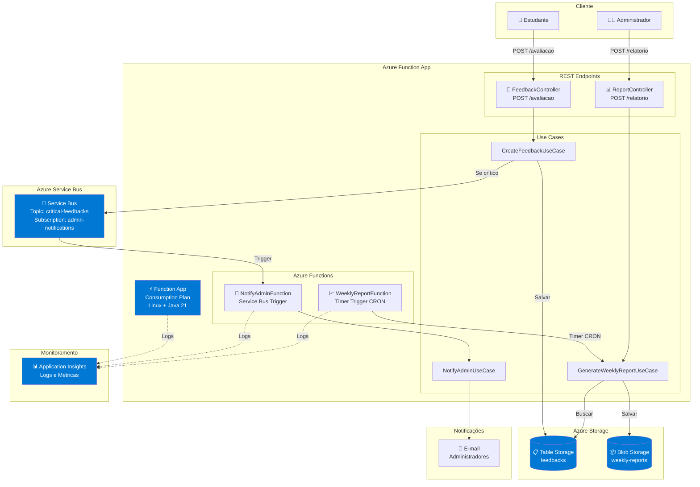
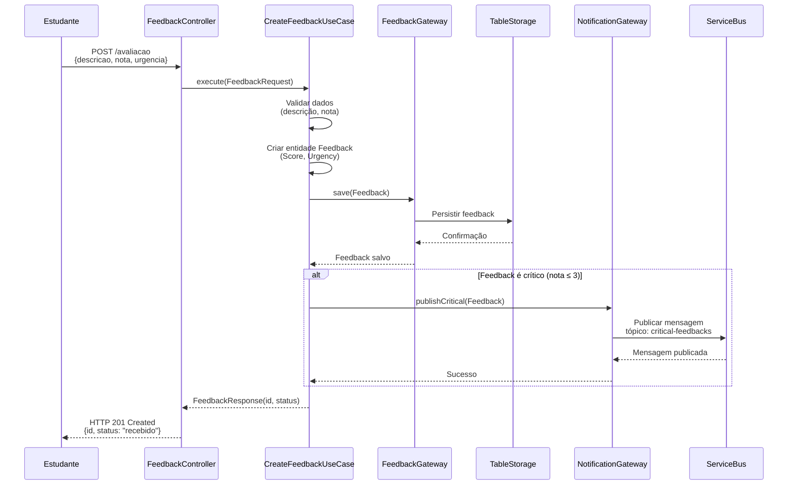
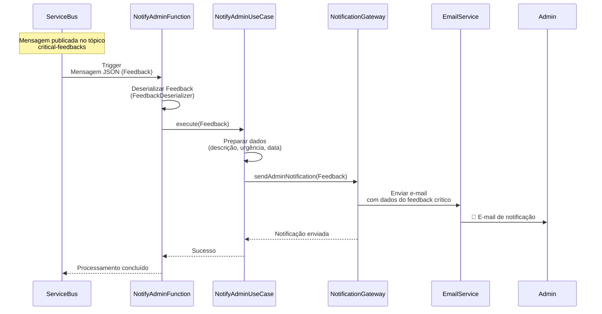
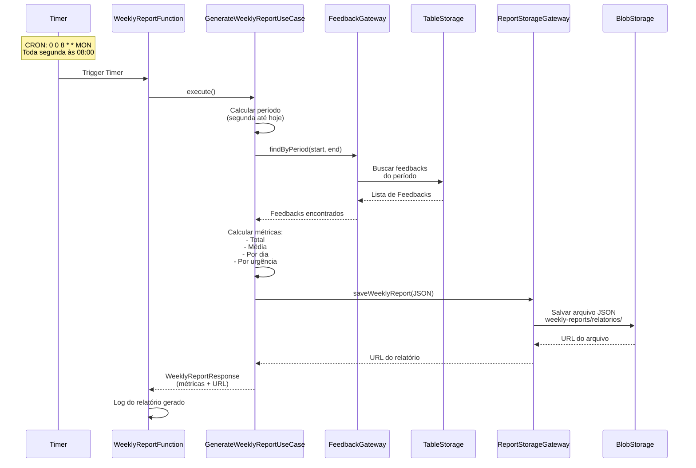
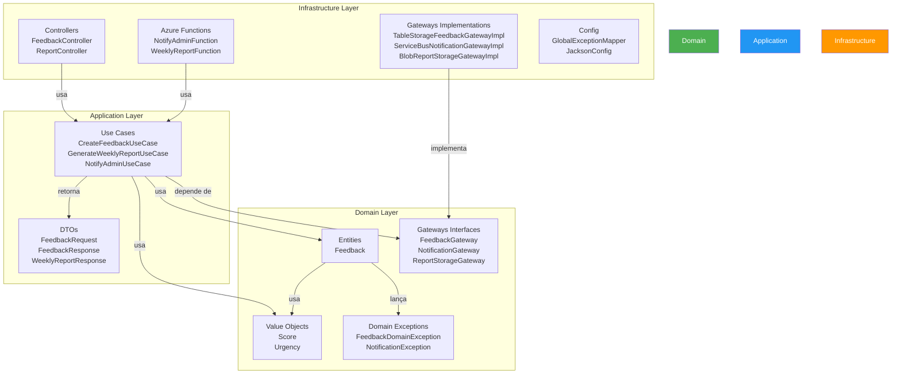
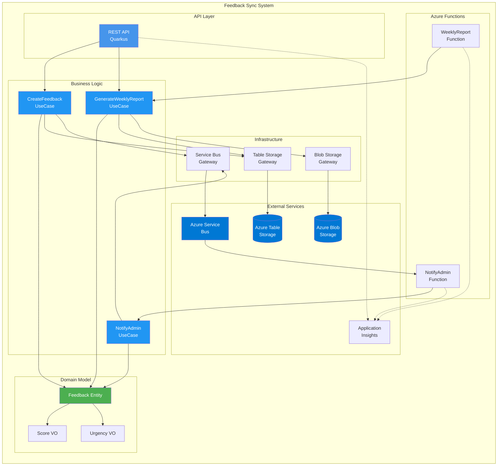
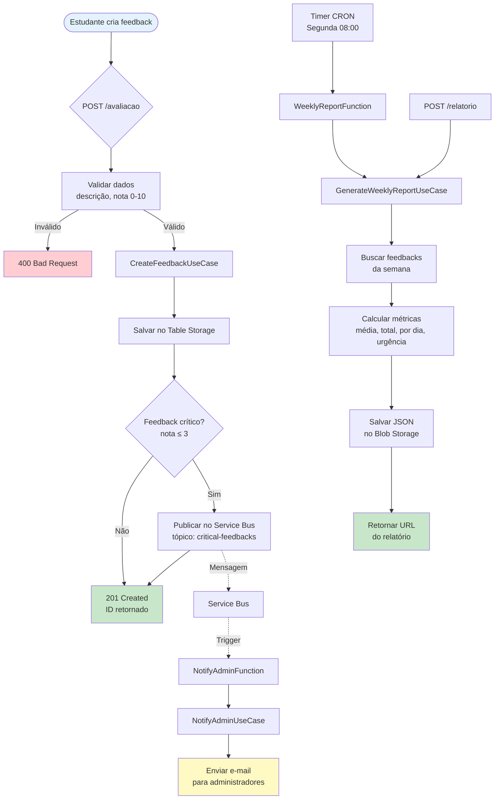
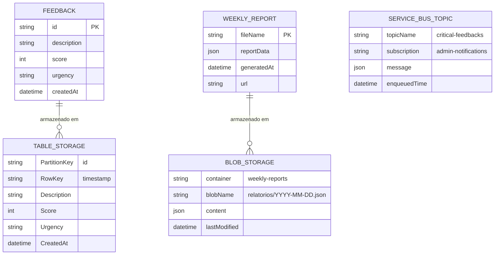
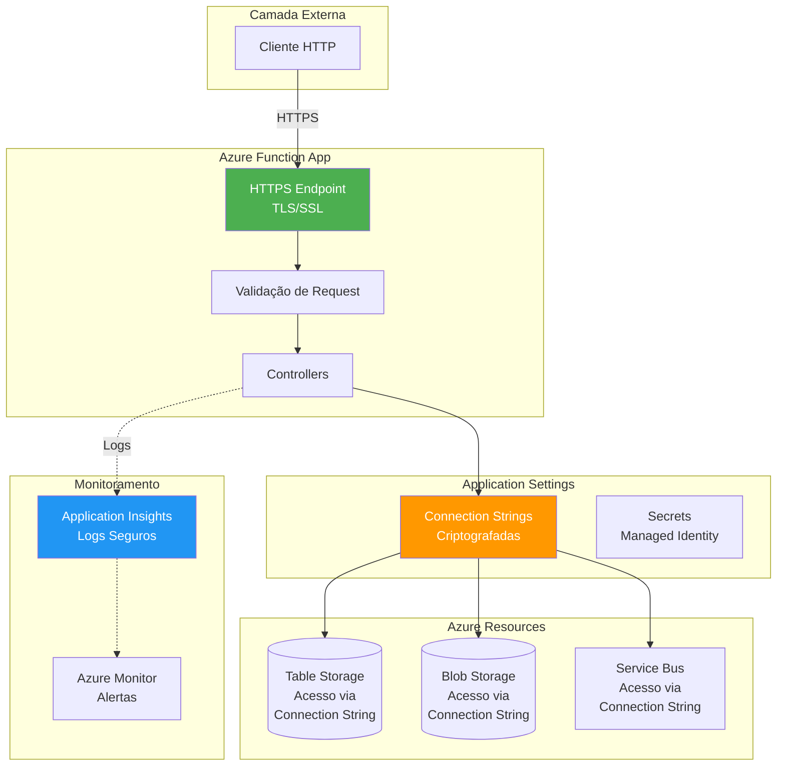
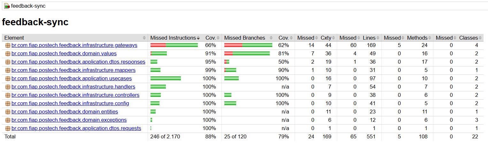

# 🎓 Feedback Sync - **Tech Challenge 4ª Fase**

Sistema de Feedback Serverless para avaliação de aulas, desenvolvido com Azure Functions, Quarkus e Clean Architecture.

**Repositório**: [https://github.com/luizffdemoraes/feedback-sync.git](https://github.com/luizffdemoraes/feedback-sync.git)

## 📑 ÍNDICE

* [Descrição do Projeto](#descrição-do-projeto)
* [Funcionalidades e Endpoints](#funcionalidades-e-endpoints)
* [Azure Functions Serverless](#azure-functions-serverless)
* [Tecnologias Utilizadas](#tecnologias-utilizadas)
* [Estrutura do Projeto](#estrutura-do-projeto)
* [Clean Architecture](#clean-architecture)
* [Arquitetura da Solução](#arquitetura-da-solução)
* [Diagramas do Sistema](#diagramas-do-sistema)
* [Requisitos](#requisitos)
* [Como Rodar o Projeto](#como-rodar-o-projeto)
* [Deploy no Azure](#deploy-no-azure)
* [Monitoramento e Segurança](#monitoramento-e-segurança)
* [Cobertura de Código](#cobertura-de-código)
* [Collection Postman](#-collection-postman)
* [Documentação Adicional](#documentação-adicional)

---

## 📌 Descrição do Projeto

O **Feedback Sync** é uma plataforma serverless hospedada no Azure que permite:

* **Estudantes** podem avaliar aulas através de feedbacks com descrição e nota (0 a 10)
* **Administradores** recebem notificações automáticas para feedbacks críticos (nota ≤ 3)
* **Relatórios semanais** são gerados automaticamente com métricas consolidadas
* **Monitoramento** completo da aplicação através do Azure Monitor

O sistema foi desenvolvido seguindo os princípios de **Clean Architecture** e **Serverless Computing**, utilizando **Azure Functions** para processamento assíncrono e escalável.

---

## ⚙️ Funcionalidades e Endpoints

### 📝 Feedback Service

| Operação | Descrição | Acesso |
|----------|-----------|--------|
| `POST /avaliacao` | Recebe feedback de avaliação de aula | Público |

**Exemplo de Requisição:**
```json
{
  "descricao": "Aula muito boa, conteúdo claro e didático",
  "nota": 8,
  "urgencia": "MEDIUM"
}
```

**Resposta:**
```json
{
  "id": "uuid-do-feedback",
  "status": "recebido"
}
```

### 📊 Report Service

| Operação | Descrição | Acesso |
|----------|-----------|--------|
| `POST /relatorio` | Gera relatório semanal manualmente | Administrador |

**Resposta:**
```json
{
  "periodo_inicio": "2024-01-15T00:00:00Z",
  "periodo_fim": "2024-01-21T23:59:59Z",
  "total_avaliacoes": 150,
  "media_avaliacoes": 7.5,
  "avaliacoes_por_dia": {
    "2024-01-15": 20,
    "2024-01-16": 25
  },
  "avaliacoes_por_urgencia": {
    "LOW": 100,
    "MEDIUM": 40,
    "HIGH": 10
  },
  "report_url": "https://storage.blob.core.windows.net/weekly-reports/relatorios/..."
}
```

---

## ⚡ Azure Functions Serverless

O sistema implementa **duas funções serverless** seguindo o princípio de **Responsabilidade Única**:

### 🔔 NotifyAdminFunction

**Tipo**: Service Bus Trigger  
**Responsabilidade**: Processar notificações críticas de feedbacks

**Fluxo:**
1. Recebe mensagem do tópico `critical-feedbacks` do Azure Service Bus
2. Deserializa o feedback crítico (nota ≤ 3)
3. Envia notificação para administradores via e-mail
4. Registra logs de processamento

**Configuração:**
- **Tópico**: `critical-feedbacks`
- **Subscription**: `admin-notifications`
- **Trigger**: Automático quando feedback crítico é publicado

**Dados da Notificação:**
- Descrição do feedback
- Urgência (LOW, MEDIUM, HIGH)
- Data de envio
- Nota da avaliação

### 📈 WeeklyReportFunction

**Tipo**: Timer Trigger  
**Responsabilidade**: Gerar relatórios semanais automaticamente

**Fluxo:**
1. Dispara automaticamente toda segunda-feira às 08:00 (CRON: `0 0 8 * * MON`)
2. Busca todos os feedbacks da semana anterior
3. Calcula métricas (total, média, por dia, por urgência)
4. Gera arquivo JSON e salva no Azure Blob Storage
5. Retorna URL de acesso ao relatório

**Configuração:**
- **Schedule**: `0 0 8 * * MON` (Toda segunda às 08:00)
- **Storage**: Azure Blob Storage (container: `weekly-reports`)

**Dados do Relatório:**
- Período (início e fim)
- Total de avaliações
- Média de avaliações
- Quantidade de avaliações por dia
- Quantidade de avaliações por urgência
- URL do arquivo JSON gerado

---

## 🛠️ Tecnologias Utilizadas


### Stack Técnica

* **Runtime**: Java 21
* **Framework**: Quarkus 3.29.0
* **Serverless**: Azure Functions (Consumption Plan)
* **Persistência**: Azure Table Storage (feedbacks)
* **Armazenamento**: Azure Blob Storage (relatórios)
* **Mensageria**: Azure Service Bus (notificações)
* **Build**: Maven 3.8+
* **Testes**: JUnit 5, Mockito, JaCoCo

---

## 📂 Estrutura do Projeto

```
feedback-sync/
├── src/
│   ├── main/
│   │   ├── java/
│   │   │   └── br/com/fiap/postech/feedback/
│   │   │       ├── application/          # Camada de Aplicação
│   │   │       │   ├── dtos/
│   │   │       │   │   ├── requests/
│   │   │       │   │   │   └── FeedbackRequest.java
│   │   │       │   │   └── responses/
│   │   │       │   │       ├── FeedbackResponse.java
│   │   │       │   │       └── WeeklyReportResponse.java
│   │   │       │   └── usecases/
│   │   │       │       ├── CreateFeedbackUseCase.java
│   │   │       │       ├── CreateFeedbackUseCaseImpl.java
│   │   │       │       ├── GenerateWeeklyReportUseCase.java
│   │   │       │       ├── GenerateWeeklyReportUseCaseImpl.java
│   │   │       │       ├── NotifyAdminUseCase.java
│   │   │       │       └── NotifyAdminUseCaseImpl.java
│   │   │       ├── domain/              # Camada de Domínio
│   │   │       │   ├── entities/
│   │   │       │   │   └── Feedback.java
│   │   │       │   ├── values/
│   │   │       │   │   ├── Score.java
│   │   │       │   │   └── Urgency.java
│   │   │       │   ├── exceptions/
│   │   │       │   │   ├── FeedbackDomainException.java
│   │   │       │   │   ├── FeedbackPersistenceException.java
│   │   │       │   │   └── NotificationException.java
│   │   │       │   └── gateways/
│   │   │       │       ├── FeedbackGateway.java
│   │   │       │       ├── NotificationGateway.java
│   │   │       │       └── ReportStorageGateway.java
│   │   │       └── infrastructure/      # Camada de Infraestrutura
│   │   │           ├── config/
│   │   │           │   ├── GlobalExceptionMapper.java
│   │   │           │   └── JacksonConfig.java
│   │   │           ├── controllers/
│   │   │           │   ├── FeedbackController.java
│   │   │           │   └── ReportController.java
│   │   │           ├── handlers/         # Azure Functions
│   │   │           │   ├── NotifyAdminFunction.java
│   │   │           │   ├── WeeklyReportFunction.java
│   │   │           │   └── FeedbackDeserializer.java
│   │   │           ├── gateways/
│   │   │           │   ├── TableStorageFeedbackGatewayImpl.java
│   │   │           │   ├── ServiceBusNotificationGatewayImpl.java
│   │   │           │   └── BlobReportStorageGatewayImpl.java
│   │   │           └── mappers/
│   │   │               └── TableStorageFeedbackMapper.java
│   │   └── resources/
│   │       ├── application.properties
│   │       ├── application-local.properties
│   │       └── local.settings.json
│   └── test/
│       └── java/... (estrutura espelhada)
├── scripts/
│   ├── criar-recursos-azure.ps1
│   ├── executar-aplicacao.ps1
│   ├── implantar-azure.ps1
│   └── testar-aplicacao.ps1
├── collection/                          # Postman Collections
├── docker-compose.yml                   # Emuladores Azure locais
├── pom.xml
├── README.md
├── GUIA_DEPLOY_AZURE.md
├── GUIA_EXECUCAO_LOCAL.md
└── GUIA_TESTE_COMPLETO.md
```

---

## 🧹 Clean Architecture

O projeto segue os princípios da **Clean Architecture**, garantindo:

* **Separação de responsabilidades** entre camadas
* **Independência de frameworks** (Quarkus, Azure)
* **Testabilidade** através de interfaces (Gateways)
* **Manutenibilidade** com código organizado e documentado

### Camadas

#### 1. **Domain** (Núcleo)
* **Entidades**: `Feedback`
* **Value Objects**: `Score`, `Urgency`
* **Interfaces (Gateways)**: `FeedbackGateway`, `NotificationGateway`, `ReportStorageGateway`
* **Exceções de Domínio**: `FeedbackDomainException`, `NotificationException`

#### 2. **Application** (Casos de Uso)
* **Use Cases**:
  - `CreateFeedbackUseCase` - Criar feedback e notificar se crítico
  - `GenerateWeeklyReportUseCase` - Gerar relatório semanal
  - `NotifyAdminUseCase` - Enviar notificação para administradores
* **DTOs**: Requests e Responses

#### 3. **Infrastructure** (Implementações)
* **Controllers**: Endpoints REST (`FeedbackController`, `ReportController`)
* **Handlers**: Azure Functions (`NotifyAdminFunction`, `WeeklyReportFunction`)
* **Gateways**: Implementações concretas (Table Storage, Service Bus, Blob Storage)
* **Config**: Configurações (Exception Mapper, Jackson)

---

## 🏗️ Arquitetura da Solução

### Componentes Azure

| Componente | Tipo | Finalidade |
|------------|------|------------|
| **Function App** | Consumption Plan (Linux) | Host da aplicação serverless |
| **Table Storage** | Standard LRS | Persistência de feedbacks |
| **Blob Storage** | Standard LRS | Armazenamento de relatórios semanais |
| **Service Bus** | Standard | Tópico para notificações críticas |
| **Application Insights** | Monitoramento | Logs, métricas e rastreamento |

---

## 📊 Diagramas do Sistema

O projeto possui um conjunto completo de diagramas em Mermaid que documentam a arquitetura, fluxos e componentes do sistema. Todos os diagramas são renderizados automaticamente no GitHub e em visualizadores Markdown compatíveis.

### 🏗️ Diagrama de Arquitetura Azure



### 🔄 Diagrama de Sequência - Criação de Feedback



### 🔔 Diagrama de Sequência - Notificação de Feedback Crítico



### 📈 Diagrama de Sequência - Geração de Relatório Semanal



### 🏛️ Diagrama de Camadas - Clean Architecture



### 🔧 Diagrama de Componentes



### 📊 Diagrama de Fluxo de Dados Completo



### 🗄️ Diagrama de Dados - Estrutura de Armazenamento



### 🔐 Diagrama de Segurança e Acesso



### 📝 Legenda dos Diagramas

#### Símbolos Utilizados

| Símbolo | Significado |
|---------|-------------|
| ⚡ | Azure Function |
| 📝 | Controller/Endpoint REST |
| 🔔 | Função de Notificação |
| 📈 | Função de Relatório |
| 📋 | Table Storage |
| 📦 | Blob Storage |
| 🚌 | Service Bus |
| 📊 | Application Insights |
| 📧 | E-mail |
| 👤 | Usuário/Cliente |
| 👨‍💼 | Administrador |

#### Cores nos Diagramas

- **Azul (#0078D4)**: Serviços Azure
- **Verde (#4CAF50)**: Camada de Domínio / Segurança
- **Laranja (#FF9800)**: Camada de Infraestrutura
- **Azul Claro (#2196F3)**: Camada de Aplicação / Monitoramento

---

### Segurança e Governança

* **Connection Strings**: Armazenadas como Application Settings (criptografadas)
* **Managed Identity**: Para acesso seguro aos recursos Azure
* **Network Security**: VNet integration (opcional)
* **Monitoring**: Application Insights com alertas configurados
* **Backup**: Retenção automática de dados no Storage

---

## 📋 Requisitos

### Software Necessário

* [Java 21](https://adoptium.net/)
* [Maven 3.8+](https://maven.apache.org/download.cgi) (ou use `mvnw` incluído)
* [Azure CLI](https://aka.ms/installazurecliwindows)
* [Docker](https://www.docker.com/) (para emuladores locais)
* [Git](https://git-scm.com/downloads) (opcional)

### Conta Azure

* Conta Azure ativa com permissões para criar recursos
* Subscription ativa no Azure

---

## ▶️ Como Rodar o Projeto

### 1. Clone o Repositório

```bash
git clone https://github.com/luizffdemoraes/feedback-sync.git
cd feedback-sync
```

### 2. Inicie os Emuladores Azure (Local)

   ```powershell
   docker-compose up -d
   ```

Isso iniciará:
* **Azurite** (Table Storage + Blob Storage) - Portas 10000, 10002
* **Service Bus Emulator** - Porta 5672
* **SQL Server** (requerido pelo Service Bus) - Porta 1433

### 3. Execute a Aplicação Localmente

```powershell
   .\mvnw.cmd quarkus:dev -Dquarkus.profile=local
   ```

A aplicação estará disponível em: `http://localhost:7071`

### 4. Teste a API

   ```powershell
# Criar feedback
   Invoke-RestMethod -Uri "http://localhost:7071/api/avaliacao" `
     -Method Post `
  -Body '{"descricao":"Aula excelente!","nota":9,"urgencia":"LOW"}' `
  -ContentType "application/json"

# Gerar relatório manualmente
Invoke-RestMethod -Uri "http://localhost:7071/api/relatorio" `
  -Method Post `
     -ContentType "application/json"
   ```

### 5. Parar os Serviços

```powershell
docker-compose down -v
```

---

## 🚀 Deploy no Azure

### Pré-requisitos

1. **Azure CLI instalado e configurado**
2. **Login no Azure**:
   ```powershell
   az login
   ```

### Deploy Automatizado

Execute o script de deploy:

```powershell
.\scripts\implantar-azure.ps1
```

O script irá:
1. Criar Resource Group
2. Criar Storage Account (Table + Blob)
3. Criar Service Bus (Tópico + Subscription)
4. Criar Function App
5. Configurar Application Settings
6. Fazer deploy da aplicação

### Deploy Manual

Consulte o guia completo: **[GUIA_DEPLOY_AZURE.md](./GUIA_DEPLOY_AZURE.md)**

---

## 📊 Monitoramento e Segurança

### Monitoramento

* **Application Insights**: Logs, métricas e rastreamento de requisições
* **Azure Monitor**: Alertas para erros e performance
* **Health Checks**: Endpoint `/health` para verificação de saúde

### Segurança

* **Connection Strings**: Armazenadas como Application Settings (criptografadas)
* **HTTPS**: Obrigatório em produção
* **CORS**: Configurado para domínios específicos
* **Rate Limiting**: Configurável via Azure Functions

### Configurações de Segurança

```properties
# Application Settings (Azure Portal)
AZURE_STORAGE_CONNECTION_STRING=<connection-string>
AZURE_SERVICEBUS_CONNECTION_STRING=<connection-string>
AzureWebJobsStorage=<storage-connection-string>
```

---

## 📈 Cobertura de Código

Gerada com **JaCoCo**.

```bash
mvn clean test
mvn jacoco:report
```

O relatório estará disponível em:
```
target/site/jacoco/index.html
```

### Exemplo da Cobertura Gerada:



---

## 📮 Collection Postman

O projeto inclui uma collection completa do Postman para facilitar os testes da API.

### 📁 Arquivos Disponíveis

* **`collection/feedback-sync.postman_collection.json`** - Collection completa com todos os endpoints da API
* **`collection/feedback-sync.postman_environment.json`** - Environment com variáveis para local e Azure

### 🚀 Como Usar

#### 1. Importar no Postman

1. Abra o Postman
2. Clique em **Import**
3. Selecione os arquivos:
   - `feedback-sync.postman_collection.json`
   - `feedback-sync.postman_environment.json`
4. Clique em **Import**

#### 2. Configurar Environment

1. No canto superior direito, selecione o environment **"Feedback Sync - Environment"**
2. Para ambiente **local**, certifique-se de que:
   - `base_url` = `http://localhost:7071`
   - `environment` = `local`
3. Para ambiente **Azure**, atualize:
   - `base_url` = `https://YOUR-FUNCTION-APP.azurewebsites.net`
   - `azure_url` = `https://YOUR-FUNCTION-APP.azurewebsites.net`
   - `environment` = `azure`

#### 3. Executar Requisições

**Health Check:**
1. Abra a pasta **"Health Check"**
2. Execute **"Health Check - Verificar Status"**
3. Deve retornar `200 OK`

**Criar Feedback:**
1. Abra a pasta **"Feedback"**
2. Execute qualquer requisição de criação de feedback
3. Exemplos disponíveis:
   - **Crítico** (nota ≤ 3) - Dispara notificação
   - **Normal** (nota média)
   - **Excelente** (nota alta)
   - **Sem urgência** (testa padrão LOW)
   - **Erros de validação** (testa validações)

**Gerar Relatório:**
1. Abra a pasta **"Relatórios"**
2. Execute **"Gerar Relatório Semanal"**
3. Retorna métricas consolidadas da semana

### 📋 Endpoints na Collection

| Pasta | Endpoint | Método | Descrição |
|-------|----------|--------|-----------|
| **Health Check** | `/health` | `GET` | Health check da aplicação |
| **Feedback** | `/avaliacao` | `POST` | Criar feedback de avaliação (7 exemplos) |
| **Relatórios** | `/relatorio` | `POST` | Gerar relatório semanal |

### 🧪 Testes Automatizados

Todas as requisições incluem testes automatizados que verificam:
- Status code correto
- Estrutura da resposta
- Tipos de dados
- Tempo de resposta

### 📝 Exemplos de Requisições

#### Criar Feedback

```json
POST /avaliacao
Content-Type: application/json

{
    "descricao": "Aula excelente!",
    "nota": 9,
    "urgencia": "LOW"
}
```

**Resposta:**
```json
{
    "id": "uuid-do-feedback",
    "status": "recebido"
}
```

#### Gerar Relatório

```json
POST /relatorio
Content-Type: application/json
```

**Resposta:**
```json
{
    "periodo_inicio": "2024-01-15T00:00:00Z",
    "periodo_fim": "2024-01-21T23:59:59Z",
    "total_avaliacoes": 150,
    "media_avaliacoes": 7.5,
    "avaliacoes_por_dia": {
        "2024-01-15": 20,
        "2024-01-16": 25
    },
    "avaliacoes_por_urgencia": {
        "LOW": 100,
        "MEDIUM": 40,
        "HIGH": 10
    },
    "report_url": "https://storage.blob.core.windows.net/weekly-reports/..."
}
```

### 🔧 Variáveis de Ambiente

| Variável | Local | Azure |
|----------|-------|-------|
| `base_url` | `http://localhost:7071` | `https://YOUR-FUNCTION-APP.azurewebsites.net` |
| `azure_url` | - | `https://YOUR-FUNCTION-APP.azurewebsites.net` |
| `environment` | `local` | `azure` |

---

## 📚 Documentação Adicional

* **[GUIA_EXECUCAO_LOCAL.md](./GUIA_EXECUCAO_LOCAL.md)** - Guia detalhado de execução local
* **[GUIA_TESTE_COMPLETO.md](./GUIA_TESTE_COMPLETO.md)** - Guia completo de testes
* **[GUIA_DEPLOY_AZURE.md](./GUIA_DEPLOY_AZURE.md)** - Guia completo de deploy no Azure

---

## 🎯 Atendimento aos Requisitos do Tech Challenge

### ✅ Requisitos Atendidos

| Requisito | Status | Implementação |
|-----------|--------|---------------|
| **Ambiente Cloud** | ✅ | Azure Functions (Consumption Plan) |
| **Serverless** | ✅ | 2 Azure Functions (NotifyAdmin, WeeklyReport) |
| **Responsabilidade Única** | ✅ | Cada função tem responsabilidade específica |
| **Deploy Automatizado** | ✅ | Script PowerShell + Azure Functions Maven Plugin |
| **Monitoramento** | ✅ | Application Insights + Azure Monitor |
| **Notificações Automáticas** | ✅ | Service Bus + NotifyAdminFunction |
| **Relatório Semanal** | ✅ | Timer Trigger + WeeklyReportFunction |
| **Segurança** | ✅ | Connection Strings criptografadas, HTTPS |
| **Governança** | ✅ | Resource Groups, Tags, Policies |

### 📝 Endpoint de Entrada

**POST /avaliacao**
```json
{
  "descricao": "string",
  "nota": 8  // int (0 a 10)
}
```

### 📧 Dados do E-mail de Urgência

* Descrição
* Urgência (LOW, MEDIUM, HIGH)
* Data de envio

### 📊 Dados do Relatório Semanal

* Descrição
* Urgência
* Data de envio
* Quantidade de avaliações por dia
* Quantidade de avaliações por urgência
* Média de avaliações

---

## 🔄 Fluxo de Mensagens Service Bus

| Evento | Tópico | Subscription | Ação |
|--------|--------|--------------|------|
| **Feedback Crítico** | `critical-feedbacks` | `admin-notifications` | NotifyAdminFunction processa e envia e-mail |

---

## 🛡️ Regras de Validação

| Validação | Descrição | Implementação |
|-----------|-----------|---------------|
| **Nota Obrigatória** | Nota deve estar entre 0 e 10 | `Score` Value Object |
| **Descrição Obrigatória** | Descrição não pode ser vazia | Validação no Use Case |
| **Urgência Padrão** | Se não informada, assume LOW | `Urgency.of()` |
| **Feedback Crítico** | Nota ≤ 3 dispara notificação | `Score.isCritical()` |

---

## 📞 Suporte

Para dúvidas ou problemas, consulte a documentação adicional ou abra uma issue no repositório.

---

**Desenvolvido para o Tech Challenge da 4ª Fase - FIAP Postech**
