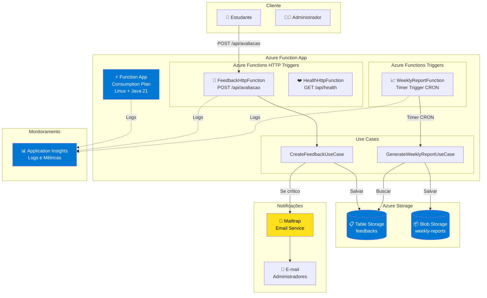
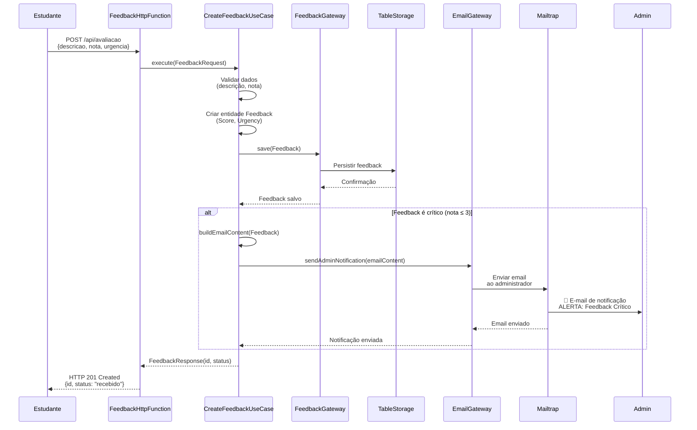
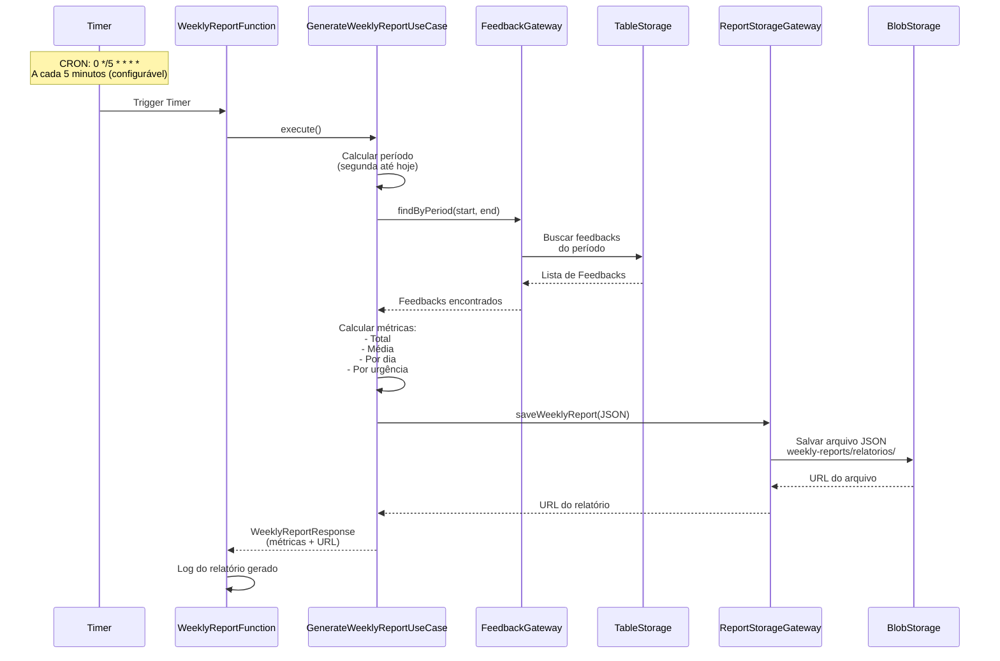
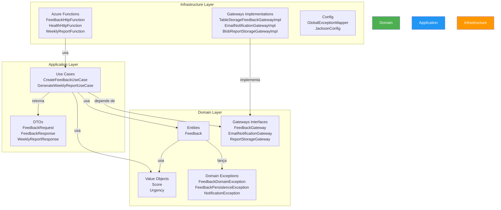
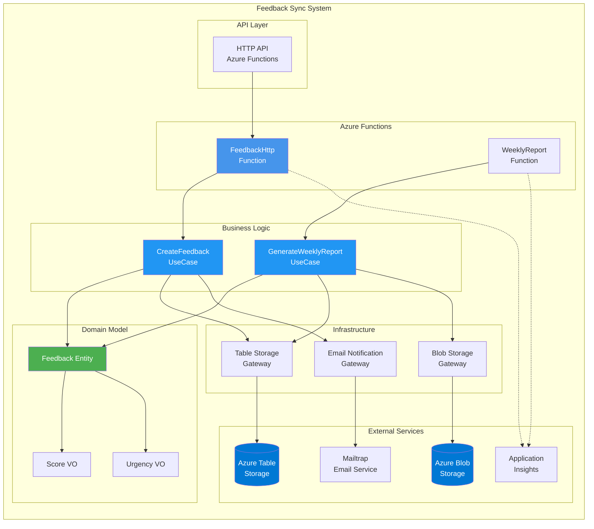
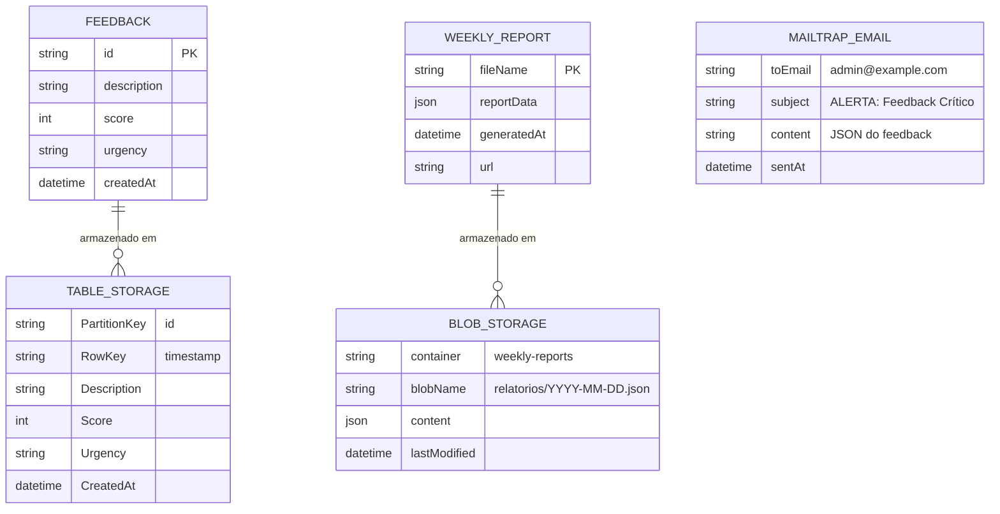
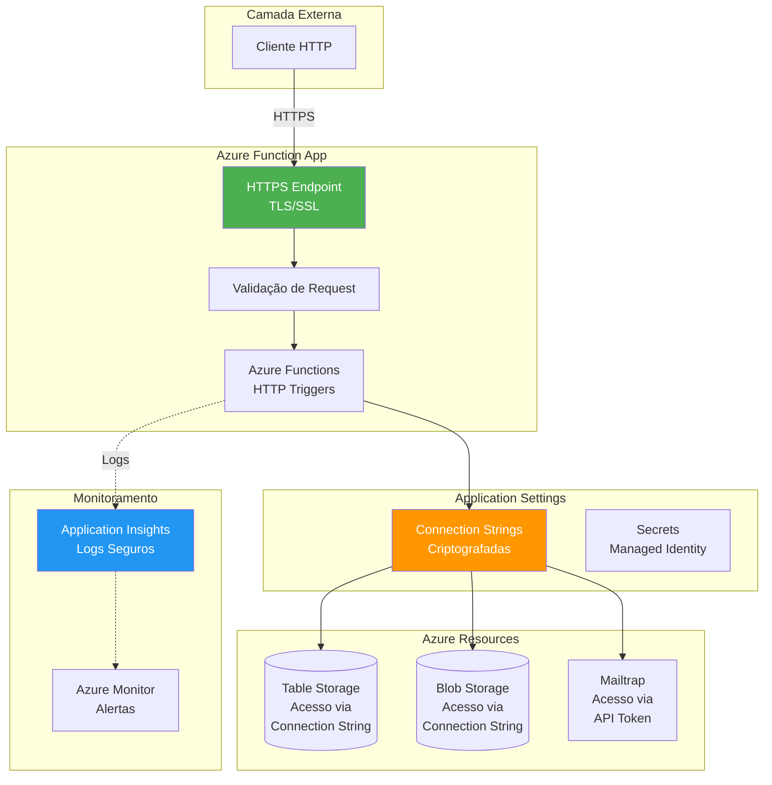

# 🎓 Feedback Sync - **Tech Challenge 4ª Fase**

Sistema de Feedback Serverless para avaliação de aulas, desenvolvido com Azure Functions, Quarkus e Clean Architecture.

**Repositório**: [https://github.com/luizffdemoraes/feedback-sync.git](https://github.com/luizffdemoraes/feedback-sync.git)

## 📑 ÍNDICE

* [Descrição do Projeto](#descrição-do-projeto)
* [Funcionalidades e Endpoints](#funcionalidades-e-endpoints)
* [Azure Functions Serverless](#azure-functions-serverless)
* [Tecnologias Utilizadas](#tecnologias-utilizadas)
* [Estrutura do Projeto](#estrutura-do-projeto)
* [Clean Architecture](#clean-architecture)
* [Arquitetura da Solução](#arquitetura-da-solução)
* [Diagramas do Sistema](#diagramas-do-sistema)
* [Requisitos](#requisitos)
* [Como Rodar o Projeto](#como-rodar-o-projeto)
* [Deploy no Azure](#deploy-no-azure)
* [Monitoramento e Segurança](#monitoramento-e-segurança)
* [Cobertura de Código](#cobertura-de-código)
* [Collection Postman](#-collection-postman)
* [Documentação Adicional](#documentação-adicional)

---

## 📌 Descrição do Projeto

O **Feedback Sync** é uma plataforma serverless hospedada no Azure que permite:

* **Estudantes** podem avaliar aulas através de feedbacks com descrição e nota (0 a 10)
* **Administradores** recebem notificações automáticas por email para feedbacks críticos (nota ≤ 3) - envio direto e síncrono
* **Relatórios semanais** são gerados automaticamente com métricas consolidadas via Timer Trigger
* **Monitoramento** completo da aplicação através do Azure Monitor

O sistema foi desenvolvido seguindo os princípios de **Clean Architecture** e **Serverless Computing**, utilizando **Azure Functions** para processamento escalável. O fluxo de notificações é direto e síncrono, simplificando a arquitetura e reduzindo custos.

---

## ⚙️ Funcionalidades e Endpoints

### 📝 Feedback Service

| Operação | Descrição | Acesso |
|----------|-----------|--------|
| `POST /avaliacao` | Recebe feedback de avaliação de aula | Público |

**Exemplo de Requisição:**
```json
{
  "descricao": "Aula muito boa, conteúdo claro e didático",
  "nota": 8,
  "urgencia": "MEDIUM"
}
```

**Resposta:**
```json
{
  "id": "uuid-do-feedback",
  "status": "recebido"
}
```

---

## ⚡ Azure Functions Serverless

O sistema implementa **duas funções serverless** seguindo o princípio de **Responsabilidade Única**:

### 📝 FeedbackHttpFunction

**Tipo**: HTTP Trigger  
**Responsabilidade**: Receber feedbacks de avaliação e processar notificações críticas

**Fluxo:**
1. Recebe requisição HTTP POST `/api/avaliacao`
2. Valida dados de entrada (descrição, nota 0-10, urgência)
3. Cria entidade Feedback e salva no Azure Table Storage
4. Se feedback é crítico (nota ≤ 3), envia email diretamente via Mailtrap
5. Retorna resposta HTTP com ID do feedback criado

**Configuração:**
- **Endpoint**: `POST /api/avaliacao`
- **Auth Level**: ANONYMOUS
- **Integração**: Azure Table Storage (persistência) + Mailtrap (envio de emails)

**Integração com Recursos Azure:**
- ✅ **Table Storage** - Persistência de feedbacks
- ✅ **Mailtrap** - Envio direto de emails para feedbacks críticos

**Notificações Automáticas:**
- ✅ Feedback crítico (nota ≤ 3) → Email enviado automaticamente
- ✅ Dados do email: Descrição, Urgência, Data de Envio
- ✅ Envio síncrono (dentro da mesma requisição HTTP)

### 📈 WeeklyReportFunction

**Tipo**: Timer Trigger  
**Responsabilidade**: Gerar relatórios semanais automaticamente

**Fluxo:**
1. Dispara automaticamente conforme agendamento configurado (padrão: a cada 5 minutos)
2. Busca todos os feedbacks da semana atual (segunda-feira até hoje)
3. Calcula métricas (total, média, por dia, por urgência)
4. Gera arquivo JSON e salva no Azure Blob Storage
5. Retorna URL de acesso ao relatório

**Configuração:**
- **Schedule**: Configurável via variável de ambiente `REPORT_SCHEDULE_CRON`
  - **Padrão**: `0 */5 * * * *` (A cada 5 minutos - para facilitar visualização de resultados)
  - **Produção semanal**: `0 0 8 * * MON` (Toda segunda às 08:00 - opcional)
- **Storage**: Azure Blob Storage (container: `weekly-reports`)
- **Período do Relatório**: Sempre semanal (segunda-feira até hoje), independente da frequência de geração

**Dados do Relatório:**
- Período (início e fim)
- Total de avaliações
- Média de avaliações
- Quantidade de avaliações por dia
- Quantidade de avaliações por urgência
- URL do arquivo JSON gerado

---

## 🛠️ Tecnologias Utilizadas


### Stack Técnica

* **Runtime**: Java 21
* **Framework**: Quarkus 3.29.0
* **Serverless**: Azure Functions (Consumption Plan)
* **Persistência**: Azure Table Storage (feedbacks)
* **Armazenamento**: Azure Blob Storage (relatórios)
* **Notificações**: Mailtrap (envio de emails)
* **Build**: Maven 3.8+
* **Testes**: JUnit 5, Mockito, JaCoCo

---

## 📂 Estrutura do Projeto

```
feedback-sync/
├── src/
│   ├── main/
│   │   ├── java/
│   │   │   └── br/com/fiap/postech/feedback/
│   │   │       ├── application/          # Camada de Aplicação
│   │   │       │   ├── dtos/
│   │   │       │   │   ├── requests/
│   │   │       │   │   │   └── FeedbackRequest.java
│   │   │       │   │   └── responses/
│   │   │       │   │       ├── FeedbackResponse.java
│   │   │       │   │       └── WeeklyReportResponse.java
│   │   │       │   └── usecases/
│   │   │       │       ├── CreateFeedbackUseCase.java
│   │   │       │       ├── CreateFeedbackUseCaseImpl.java
│   │   │       │       ├── GenerateWeeklyReportUseCase.java
│   │   │       │       ├── GenerateWeeklyReportUseCaseImpl.java
│   │   │       ├── domain/              # Camada de Domínio
│   │   │       │   ├── entities/
│   │   │       │   │   └── Feedback.java
│   │   │       │   ├── values/
│   │   │       │   │   ├── Score.java
│   │   │       │   │   └── Urgency.java
│   │   │       │   ├── exceptions/
│   │   │       │   │   ├── FeedbackDomainException.java
│   │   │       │   │   ├── FeedbackPersistenceException.java
│   │   │       │   │   └── NotificationException.java
│   │   │       │   └── gateways/
│   │   │       │       ├── FeedbackGateway.java
│   │   │       │       ├── EmailNotificationGateway.java
│   │   │       │       └── ReportStorageGateway.java
│   │   │       └── infrastructure/      # Camada de Infraestrutura
│   │   │           ├── config/
│   │   │           │   ├── GlobalExceptionMapper.java
│   │   │           │   └── JacksonConfig.java
│   │   │           ├── handlers/         # Azure Functions
│   │   │           │   ├── FeedbackHttpFunction.java
│   │   │           │   ├── HealthHttpFunction.java
│   │   │           │   └── WeeklyReportFunction.java
│   │   │           ├── gateways/
│   │   │           │   ├── TableStorageFeedbackGatewayImpl.java
│   │   │           │   ├── EmailNotificationGatewayImpl.java
│   │   │           │   └── BlobReportStorageGatewayImpl.java
│   │   │           └── mappers/
│   │   │               └── TableStorageFeedbackMapper.java
│   │   └── resources/
│   │       ├── application.properties
│   │       ├── application-local.properties
│   │       └── local.settings.json
│   └── test/
│       └── java/... (estrutura espelhada)
├── scripts/
│   ├── criar-recursos-azure.ps1          # Cria recursos no Azure
│   ├── configurar-storage-connection.ps1 # Configura storage connection
│   ├── verificar-variaveis-cloud.ps1    # Verifica variáveis na cloud
│   ├── implantar-azure.ps1               # Faz deploy da aplicação
│   ├── deletar-function-app.ps1         # Deleta apenas Function App
│   ├── deletar-recursos-azure.ps1        # Deleta todos os recursos
│   ├── executar-aplicacao.ps1            # Executa aplicação localmente
│   ├── executar-azure-functions-local.ps1 # Executa Azure Functions localmente
│   ├── testar-aplicacao.ps1             # Testa aplicação completa
│   └── verificar-variaveis-ambiente.ps1  # Verifica variáveis locais
├── collection/                          # Postman Collections
├── docker-compose.yml                   # Emuladores Azure locais
├── pom.xml
├── README.md
├── GUIA_DEPLOY_AZURE.md
├── GUIA_EXECUCAO_LOCAL.md
└── GUIA_TESTE_COMPLETO.md
```

---

## 🧹 Clean Architecture

O projeto segue os princípios da **Clean Architecture**, garantindo:

* **Separação de responsabilidades** entre camadas
* **Independência de frameworks** (Quarkus, Azure)
* **Testabilidade** através de interfaces (Gateways)
* **Manutenibilidade** com código organizado e documentado

### Camadas

#### 1. **Domain** (Núcleo)
* **Entidades**: `Feedback`
* **Value Objects**: `Score`, `Urgency`
* **Interfaces (Gateways)**: `FeedbackGateway`, `EmailNotificationGateway`, `ReportStorageGateway`
* **Exceções de Domínio**: `FeedbackDomainException`, `FeedbackPersistenceException`, `NotificationException`

#### 2. **Application** (Casos de Uso)
* **Use Cases**:
  - `CreateFeedbackUseCase` - Criar feedback e notificar se crítico
  - `GenerateWeeklyReportUseCase` - Gerar relatório semanal
* **DTOs**: Requests e Responses

#### 3. **Infrastructure** (Implementações)
* **Handlers**: Azure Functions (`FeedbackHttpFunction`, `HealthHttpFunction`, `WeeklyReportFunction`)
* **Gateways**: Implementações concretas (Table Storage, Mailtrap, Blob Storage)
* **Config**: Configurações (Exception Mapper, Jackson)

---

## 🏗️ Arquitetura da Solução

### Componentes Azure

| Componente | Tipo | Finalidade |
|------------|------|------------|
| **Function App** | Consumption Plan (Linux) | Host da aplicação serverless |
| **Table Storage** | Standard LRS | Persistência de feedbacks |
| **Blob Storage** | Standard LRS | Armazenamento de relatórios semanais |
| **Mailtrap** | Free Tier | Envio de emails para notificações críticas |
| **Application Insights** | Monitoramento | Logs, métricas e rastreamento |

**🌍 Região**: Todos os recursos Azure são criados na região **`northcentralus`** (North Central US) por padrão, garantindo baixa latência entre componentes e otimização de custos.

---

## 📊 Diagramas do Sistema

O projeto possui um conjunto completo de diagramas em Mermaid que documentam a arquitetura, fluxos e componentes do sistema. Todos os diagramas são renderizados automaticamente no GitHub e em visualizadores Markdown compatíveis.

### 🏗️ Diagrama de Arquitetura Azure



### 🔄 Diagrama de Sequência - Criação de Feedback




### 📈 Diagrama de Sequência - Geração de Relatório Semanal



### 🏛️ Diagrama de Camadas - Clean Architecture



### 🔧 Diagrama de Componentes



### 📊 Diagrama de Fluxo de Dados Completo

```mermaid
flowchart TD
    Start([Estudante cria feedback]) --> Input{POST /avaliacao}
    
    Input --> Validate[Validar dados<br/>descrição, nota 0-10]
    
    Validate -->|Inválido| Error1[400 Bad Request]
    Validate -->|Válido| Create[CreateFeedbackUseCase]
    
    Create --> Save[Salvar no Table Storage]
    Save --> Check{Feedback crítico?<br/>nota ≤ 3}
    
    Check -->|Não| Success1[201 Created<br/>ID retornado]
    Check -->|Sim| SendEmail[Enviar email<br/>via Mailtrap]
    
    SendEmail --> Success1
    
    SendEmail -.->|Email| Mailtrap[Mailtrap<br/>Email Service]
    Mailtrap -.->|Email| Admin[Administrador<br/>recebe email]
    
    Timer[Timer CRON<br/>0 */5 * * * *<br/>(A cada 5 min - configurável)] --> WeeklyFunc[WeeklyReportFunction]
    WeeklyFunc --> ReportUC[GenerateWeeklyReportUseCase]
    ReportUC --> Fetch[Buscar feedbacks<br/>da semana]
    Fetch --> Calc[Calcular métricas<br/>média, total, por dia, urgência]
    Calc --> SaveReport[Salvar JSON<br/>no Blob Storage]
    SaveReport --> Return[Retornar URL<br/>do relatório]
    
    style Start fill:#E3F2FD
    style Success1 fill:#C8E6C9
    style Error1 fill:#FFCDD2
    style Email fill:#FFF9C4
    style Return fill:#C8E6C9
```

### 🗄️ Diagrama de Dados - Estrutura de Armazenamento



### 🔐 Diagrama de Segurança e Acesso



### 📝 Legenda dos Diagramas

#### Símbolos Utilizados

| Símbolo | Significado |
|---------|-------------|
| ⚡ | Azure Function |
| 📝 | Azure Function HTTP Trigger |
| 🔔 | Função de Notificação |
| 📈 | Função de Relatório |
| 📋 | Table Storage |
| 📦 | Blob Storage |
| 📧 | Mailtrap |
| 📊 | Application Insights |
| 📧 | E-mail |
| 👤 | Usuário/Cliente |
| 👨‍💼 | Administrador |

#### Cores nos Diagramas

- **Azul (#0078D4)**: Serviços Azure
- **Verde (#4CAF50)**: Camada de Domínio / Segurança
- **Laranja (#FF9800)**: Camada de Infraestrutura
- **Azul Claro (#2196F3)**: Camada de Aplicação / Monitoramento

---

### Segurança e Governança

* **Connection Strings**: Armazenadas como Application Settings (criptografadas)
* **Managed Identity**: Para acesso seguro aos recursos Azure
* **Network Security**: VNet integration (opcional)
* **Monitoring**: Application Insights com alertas configurados
* **Backup**: Retenção automática de dados no Storage

---

## 📋 Requisitos

### Software Necessário

* [Java 21](https://adoptium.net/)
* [Maven 3.8+](https://maven.apache.org/download.cgi) (ou use `mvnw` incluído)
* [Azure CLI](https://aka.ms/installazurecliwindows)
* [Docker](https://www.docker.com/) (para emuladores locais)
* [Git](https://git-scm.com/downloads) (opcional)

### Conta Azure

* Conta Azure ativa com permissões para criar recursos
* Subscription ativa no Azure

---

## ▶️ Como Rodar o Projeto

### 1. Clone o Repositório

```bash
git clone https://github.com/luizffdemoraes/feedback-sync.git
cd feedback-sync
```

### 2. Inicie os Emuladores Azure (Local)

   ```powershell
   docker-compose up -d
   ```

Isso iniciará:
* **Azurite** (Table Storage + Blob Storage) - Portas 10000, 10002

### 3. Execute a Aplicação Localmente

```powershell
   .\mvnw.cmd quarkus:dev -Dquarkus.profile=local
   ```

A aplicação estará disponível em: `http://localhost:7071`

### 4. Teste a API

   ```powershell
# Criar feedback
   Invoke-RestMethod -Uri "http://localhost:7071/avaliacao" `
     -Method Post `
  -Body '{"descricao":"Aula excelente!","nota":9,"urgencia":"LOW"}' `
  -ContentType "application/json"

# Gerar relatório manualmente
# Nota: O relatório semanal é gerado automaticamente via Timer Trigger (WeeklyReportFunction)
# Não há endpoint REST para geração manual
   ```

### 5. Parar os Serviços

```powershell
docker-compose down -v
```

---

## 🚀 Deploy no Azure

### ⚡ Passo a Passo Rápido

Siga estes passos **na ordem** para fazer deploy completo:

1. **Criar Recursos Azure:**
   ```powershell
   .\scripts\criar-recursos-azure.ps1
   ```
   Ou com Mailtrap:
   ```powershell
   .\scripts\criar-recursos-azure.ps1 -MailtrapApiToken "token" -MailtrapInboxId "id" -AdminEmail "email@exemplo.com"
   ```

2. **Configurar Storage Connection String:**
   ```powershell
   .\scripts\configurar-storage-connection.ps1
   ```

3. **Verificar Variáveis de Ambiente:**
   ```powershell
   .\scripts\verificar-variaveis-cloud.ps1
   ```

4. **Fazer Deploy:**
   ```powershell
   .\scripts\implantar-azure.ps1
   ```

5. **Testar:**
   ```bash
   curl --location 'https://feedback-function-prod.azurewebsites.net/api/avaliacao' \
   --header 'Content-Type: application/json' \
   --data '{"descricao":"Teste","nota":2,"urgencia":"HIGH"}'
   ```

6. **Verificar logs (se email não for enviado):**
   Verifique os logs da Function App no portal Azure para confirmar o envio de emails.

**📖 Para mais detalhes, consulte:** [GUIA_DEPLOY_AZURE.md](GUIA_DEPLOY_AZURE.md)

---

### Pré-requisitos

1. **Azure CLI instalado e configurado**
2. **Login no Azure**:
   ```powershell
   az login
   ```

### Deploy Automatizado (Detalhado)

**Ordem de execução dos scripts:**

1. **Criar Recursos Azure:**
   ```powershell
   .\scripts\criar-recursos-azure.ps1
   ```
   - Cria Resource Group, Storage Account e Function App
   - Configura variáveis de ambiente básicas
   - Opcional: Configura Mailtrap se parâmetros fornecidos

2. **Configurar Storage Connection String:**
   ```powershell
   .\scripts\configurar-storage-connection.ps1
   ```
   - Verifica e configura `AZURE_STORAGE_CONNECTION_STRING`
   - Usa `AzureWebJobsStorage` como fallback se disponível

3. **Verificar Configurações:**
   ```powershell
   .\scripts\verificar-variaveis-cloud.ps1
   ```
   - Verifica se todas as variáveis estão configuradas
   - Diagnostica o fluxo completo

4. **Fazer Deploy:**
   ```powershell
   .\scripts\implantar-azure.ps1
   ```
   - Compila o projeto
   - Faz deploy para a Function App

**🌍 Região Azure**: Por padrão, todos os recursos são criados na região **`northcentralus`** (North Central US). Esta região foi escolhida por ser compatível com assinaturas Azure for Students. Se precisar usar outra região, especifique o parâmetro `-Location` ao executar o script.

### Deploy Manual

Consulte o guia completo: **[GUIA_DEPLOY_AZURE.md](./GUIA_DEPLOY_AZURE.md)**

---

## 📊 Monitoramento e Segurança

### Monitoramento

* **Application Insights**: Logs, métricas e rastreamento de requisições
* **Azure Monitor**: Alertas para erros e performance
* **Health Checks**: Endpoint `/health` para verificação de saúde

### Segurança

* **Connection Strings**: Armazenadas como Application Settings (criptografadas)
* **HTTPS**: Obrigatório em produção
* **CORS**: Configurado para domínios específicos
* **Rate Limiting**: Configurável via Azure Functions

### Configurações de Segurança

```properties
# Application Settings (Azure Portal)
AZURE_STORAGE_CONNECTION_STRING=<connection-string>
AzureWebJobsStorage=<storage-connection-string>
MAILTRAP_API_TOKEN=<your-mailtrap-api-token>
MAILTRAP_INBOX_ID=<your-mailtrap-inbox-id>
ADMIN_EMAIL=<admin@example.com>
```

---

## 📈 Cobertura de Código

Gerada com **JaCoCo**.

```bash
mvn clean test
mvn jacoco:report
```

O relatório estará disponível em:
```
target/site/jacoco/index.html
```

### Exemplo da Cobertura Gerada:


---

## 📮 Collection Postman

O projeto inclui uma collection completa do Postman para facilitar os testes da API.

### 📁 Arquivos Disponíveis

* **`collection/feedback-sync.postman_collection.json`** - Collection completa com todos os endpoints da API
* **`collection/feedback-sync.postman_environment.json`** - Environment com variáveis para local e Azure

### 🚀 Como Usar

#### 1. Importar no Postman

1. Abra o Postman
2. Clique em **Import**
3. Selecione os arquivos:
   - `feedback-sync.postman_collection.json`
   - `feedback-sync.postman_environment.json`
4. Clique em **Import**

#### 2. Configurar Environment

1. No canto superior direito, selecione o environment **"Feedback Sync - Environment"**
2. Para ambiente **local**, certifique-se de que:
   - `base_url` = `http://localhost:7071`
   - `environment` = `local`
3. Para ambiente **Azure**, atualize:
   - `base_url` = `https://YOUR-FUNCTION-APP.azurewebsites.net`
   - `azure_url` = `https://YOUR-FUNCTION-APP.azurewebsites.net`
   - `environment` = `azure`

#### 3. Executar Requisições

**Health Check:**
1. Abra a pasta **"Health Check"**
2. Execute **"Health Check - Verificar Status"**
3. Deve retornar `200 OK`

**Criar Feedback:**
1. Abra a pasta **"Feedback"**
2. Execute qualquer requisição de criação de feedback
3. Exemplos disponíveis:
   - **Crítico** (nota ≤ 3) - Dispara notificação
   - **Normal** (nota média)
   - **Excelente** (nota alta)
   - **Sem urgência** (testa padrão LOW)
   - **Erros de validação** (testa validações)

**Gerar Relatório:**
1. Abra a pasta **"Relatórios"**
2. Execute **"Gerar Relatório Semanal"**
3. Retorna métricas consolidadas da semana

### 📋 Endpoints na Collection

| Pasta | Endpoint | Método | Descrição |
|-------|----------|--------|-----------|
| **Health Check** | `/health` | `GET` | Health check da aplicação |
| **Feedback** | `/avaliacao` | `POST` | Criar feedback de avaliação (7 exemplos) |

### 🧪 Testes Automatizados

Todas as requisições incluem testes automatizados que verificam:
- Status code correto
- Estrutura da resposta
- Tipos de dados
- Tempo de resposta

### 📝 Exemplos de Requisições

#### Criar Feedback

```json
POST /avaliacao
Content-Type: application/json

{
    "descricao": "Aula excelente!",
    "nota": 9,
    "urgencia": "LOW"
}
```

**Resposta:**
```json
{
    "id": "uuid-do-feedback",
    "status": "recebido"
}
```


### 🔧 Variáveis de Ambiente

| Variável | Local | Azure |
|----------|-------|-------|
| `base_url` | `http://localhost:7071` | `https://YOUR-FUNCTION-APP.azurewebsites.net` |
| `azure_url` | - | `https://YOUR-FUNCTION-APP.azurewebsites.net` |
| `environment` | `local` | `azure` |

---

## 📚 Documentação Adicional

* **[GUIA_EXECUCAO_LOCAL.md](./GUIA_EXECUCAO_LOCAL.md)** - Guia detalhado de execução local
* **[GUIA_TESTE_COMPLETO.md](./GUIA_TESTE_COMPLETO.md)** - Guia completo de testes
* **[GUIA_DEPLOY_AZURE.md](./GUIA_DEPLOY_AZURE.md)** - Guia completo de deploy no Azure

---

## 🎯 Atendimento aos Requisitos do Tech Challenge

### ✅ Requisitos Atendidos

| Requisito | Status | Implementação |
|-----------|--------|---------------|
| **Ambiente Cloud** | ✅ | Azure Functions (Consumption Plan) |
| **Serverless** | ✅ | 2 Azure Functions (FeedbackHttpFunction, WeeklyReportFunction) |
| **Responsabilidade Única** | ✅ | Cada função tem responsabilidade específica |
| **Deploy Automatizado** | ✅ | Script PowerShell + Azure Functions Maven Plugin |
| **Monitoramento** | ✅ | Application Insights + Azure Monitor |
| **Notificações Automáticas** | ✅ | Mailtrap (envio direto e síncrono de emails para feedbacks críticos) |
| **Relatório Semanal** | ✅ | Timer Trigger + WeeklyReportFunction |
| **Segurança** | ✅ | Connection Strings criptografadas, HTTPS |
| **Governança** | ✅ | Resource Groups, Tags, Policies |

### 📝 Endpoint de Entrada

**POST /avaliacao**
```json
{
  "descricao": "string",
  "nota": 8  // int (0 a 10)
}
```

### 📧 Dados do E-mail de Urgência

* Descrição
* Urgência (LOW, MEDIUM, HIGH)
* Data de envio

### 📊 Dados do Relatório Semanal

* Descrição
* Urgência
* Data de envio
* Quantidade de avaliações por dia
* Quantidade de avaliações por urgência
* Média de avaliações

---

## 🔄 Fluxo de Notificações

| Evento | Gateway | Serviço | Ação |
|--------|---------|---------|------|
| **Feedback Crítico** | EmailNotificationGateway | Mailtrap | Envia email diretamente ao administrador (síncrono) |

---

## 🛡️ Regras de Validação

| Validação | Descrição | Implementação |
|-----------|-----------|---------------|
| **Nota Obrigatória** | Nota deve estar entre 0 e 10 | `Score` Value Object |
| **Descrição Obrigatória** | Descrição não pode ser vazia | Validação no Use Case |
| **Urgência Padrão** | Se não informada, assume LOW | `Urgency.of()` |
| **Feedback Crítico** | Nota ≤ 3 dispara notificação | `Score.isCritical()` |

---

## 🎬 Configuração para Demonstração e Gravação de Vídeo

Para fins didáticos e gravação de vídeo, você pode configurar o relatório para ser gerado com maior frequência:

### Configurar CRON para Demonstração

**No Azure (Cloud):**
```powershell
# A cada 5 minutos (recomendado para demonstração)
az functionapp config appsettings set `
    --name feedback-function-<seu-sufixo> `
    --resource-group feedback-rg `
    --settings "REPORT_SCHEDULE_CRON=0 */5 * * * *"
```

**Localmente (local.settings.json):**
```json
{
  "Values": {
    "REPORT_SCHEDULE_CRON": "0 */5 * * * *"
  }
}
```

### Opções de Agendamento

| Frequência | CRON Expression | Uso |
|------------|----------------|-----|
| **A cada 5 minutos** (padrão) | `0 */5 * * * *` | Padrão configurado - facilita visualização de resultados |
| **A cada 15 minutos** | `0 */15 * * * *` | Demonstração moderada |
| **A cada hora** | `0 0 * * * *` | Testes prolongados |
| **Semanal** | `0 0 8 * * MON` | Produção real (opcional - reduz custos) |

**⚠️ Importante:**
- O período do relatório continua sendo **semanal** (segunda até hoje)
- Apenas a **frequência de geração** muda
- **Padrão: a cada 5 minutos** para facilitar visualização durante desenvolvimento/demonstração
- Para produção real, pode alterar para semanal para evitar custos desnecessários
- Consulte **[GUIA_DEPLOY_AZURE.md](./GUIA_DEPLOY_AZURE.md)** para mais detalhes

---

## 📞 Suporte

Para dúvidas ou problemas, consulte a documentação adicional ou abra uma issue no repositório.

---

**Desenvolvido para o Tech Challenge da 4ª Fase - FIAP Postech**
