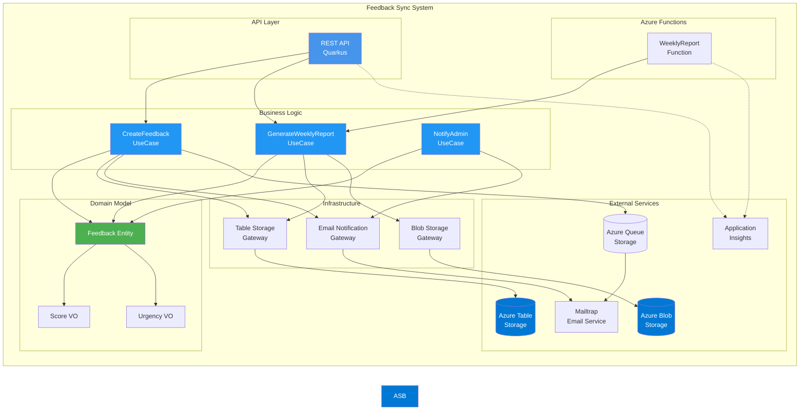

# 🎓 Feedback Sync - **Tech Challenge 4ª Fase**

Sistema de Feedback Serverless para avaliação de aulas, desenvolvido com Azure Functions, Quarkus e Clean Architecture.

**Repositório**: [https://github.com/luizffdemoraes/feedback-sync.git](https://github.com/luizffdemoraes/feedback-sync.git)

## 📑 ÍNDICE

* [Descrição do Projeto](#descrição-do-projeto)
* [Funcionalidades e Endpoints](#funcionalidades-e-endpoints)
* [Azure Functions Serverless](#azure-functions-serverless)
* [Tecnologias Utilizadas](#tecnologias-utilizadas)
* [Estrutura do Projeto](#estrutura-do-projeto)
* [Clean Architecture](#clean-architecture)
* [Arquitetura da Solução](#arquitetura-da-solução)
* [Diagramas do Sistema](#diagramas-do-sistema)
* [Requisitos](#requisitos)
* [Como Rodar o Projeto](#como-rodar-o-projeto)
* [Deploy no Azure](#deploy-no-azure)
* [Monitoramento e Segurança](#monitoramento-e-segurança)
* [Cobertura de Código](#cobertura-de-código)
* [Collection Postman](#-collection-postman)
* [Documentação Adicional](#documentação-adicional)

---

## 📌 Descrição do Projeto

O **Feedback Sync** é uma plataforma serverless hospedada no Azure que permite:

* **Estudantes** podem avaliar aulas através de feedbacks com descrição e nota (0 a 10)
* **Administradores** recebem notificações automáticas para feedbacks críticos (nota ≤ 3)
* **Relatórios semanais** são gerados automaticamente com métricas consolidadas
* **Monitoramento** completo da aplicação através do Azure Monitor

O sistema foi desenvolvido seguindo os princípios de **Clean Architecture** e **Serverless Computing**, utilizando **Azure Functions** para processamento assíncrono e escalável.

---

## ⚙️ Funcionalidades e Endpoints

### 📝 Feedback Service

| Operação | Descrição | Acesso |
|----------|-----------|--------|
| `POST /avaliacao` | Recebe feedback de avaliação de aula | Público |

**Exemplo de Requisição:**
```json
{
  "descricao": "Aula muito boa, conteúdo claro e didático",
  "nota": 8,
  "urgencia": "MEDIUM"
}
```

**Resposta:**
```json
{
  "id": "uuid-do-feedback",
  "status": "recebido"
}
```

### 📊 Report Service

| Operação | Descrição | Acesso |
|----------|-----------|--------|
| `POST /relatorio` | Gera relatório semanal manualmente | Administrador |

**Resposta:**
```json
{
  "periodo_inicio": "2024-01-15T00:00:00Z",
  "periodo_fim": "2024-01-21T23:59:59Z",
  "total_avaliacoes": 150,
  "media_avaliacoes": 7.5,
  "avaliacoes_por_dia": {
    "2024-01-15": 20,
    "2024-01-16": 25
  },
  "avaliacoes_por_urgencia": {
    "LOW": 100,
    "MEDIUM": 40,
    "HIGH": 10
  },
  "report_url": "https://storage.blob.core.windows.net/weekly-reports/relatorios/..."
}
```

---

## ⚡ Azure Functions Serverless

O sistema implementa **duas funções serverless** seguindo o princípio de **Responsabilidade Única**:

### 🔔 NotifyAdminFunction

**Tipo**: Queue Trigger  
**Responsabilidade**: Processar notificações críticas de feedbacks da fila

**Fluxo:**
1. Recebe mensagem da fila `critical-feedbacks` do Azure Queue Storage
2. Deserializa o feedback crítico (nota ≤ 3)
3. Envia notificação para administradores via Mailtrap
4. Registra logs de processamento

**Configuração:**
- **Fila**: `critical-feedbacks` (Azure Queue Storage)
- **Trigger**: Automático quando mensagem é publicada na fila
- **Integração**: Azure Queue Storage (trigger) + Mailtrap (envio de emails)

**Integração com Recursos Azure:**
- ✅ **Queue Storage** - Fila de mensagens críticas
- ✅ **Mailtrap** - Envio de emails

### 📈 WeeklyReportFunction

**Tipo**: Timer Trigger  
**Responsabilidade**: Gerar relatórios semanais automaticamente

**Fluxo:**
1. Dispara automaticamente toda segunda-feira às 08:00 (CRON: `0 0 8 * * MON`)
2. Busca todos os feedbacks da semana anterior
3. Calcula métricas (total, média, por dia, por urgência)
4. Gera arquivo JSON e salva no Azure Blob Storage
5. Retorna URL de acesso ao relatório

**Configuração:**
- **Schedule**: `0 0 8 * * MON` (Toda segunda às 08:00)
- **Storage**: Azure Blob Storage (container: `weekly-reports`)

**Dados do Relatório:**
- Período (início e fim)
- Total de avaliações
- Média de avaliações
- Quantidade de avaliações por dia
- Quantidade de avaliações por urgência
- URL do arquivo JSON gerado

---

## 🛠️ Tecnologias Utilizadas


### Stack Técnica

* **Runtime**: Java 21
* **Framework**: Quarkus 3.29.0
* **Serverless**: Azure Functions (Consumption Plan)
* **Persistência**: Azure Table Storage (feedbacks)
* **Armazenamento**: Azure Blob Storage (relatórios)
* **Notificações**: Mailtrap (envio de emails)
* **Build**: Maven 3.8+
* **Testes**: JUnit 5, Mockito, JaCoCo

---

## 📂 Estrutura do Projeto

```
feedback-sync/
├── src/
│   ├── main/
│   │   ├── java/
│   │   │   └── br/com/fiap/postech/feedback/
│   │   │       ├── application/          # Camada de Aplicação
│   │   │       │   ├── dtos/
│   │   │       │   │   ├── requests/
│   │   │       │   │   │   └── FeedbackRequest.java
│   │   │       │   │   └── responses/
│   │   │       │   │       ├── FeedbackResponse.java
│   │   │       │   │       └── WeeklyReportResponse.java
│   │   │       │   └── usecases/
│   │   │       │       ├── CreateFeedbackUseCase.java
│   │   │       │       ├── CreateFeedbackUseCaseImpl.java
│   │   │       │       ├── GenerateWeeklyReportUseCase.java
│   │   │       │       ├── GenerateWeeklyReportUseCaseImpl.java
│   │   │       ├── domain/              # Camada de Domínio
│   │   │       │   ├── entities/
│   │   │       │   │   └── Feedback.java
│   │   │       │   ├── values/
│   │   │       │   │   ├── Score.java
│   │   │       │   │   └── Urgency.java
│   │   │       │   ├── exceptions/
│   │   │       │   │   ├── FeedbackDomainException.java
│   │   │       │   │   ├── FeedbackPersistenceException.java
│   │   │       │   │   └── NotificationException.java
│   │   │       │   └── gateways/
│   │   │       │       ├── FeedbackGateway.java
│   │   │       │       ├── NotificationGateway.java
│   │   │       │       └── ReportStorageGateway.java
│   │   │       └── infrastructure/      # Camada de Infraestrutura
│   │   │           ├── config/
│   │   │           │   ├── GlobalExceptionMapper.java
│   │   │           │   └── JacksonConfig.java
│   │   │           ├── controllers/
│   │   │           │   ├── FeedbackController.java
│   │   │           │   └── ReportController.java
│   │   │           ├── handlers/         # Azure Functions
│   │   │           │   ├── NotifyAdminFunction.java
│   │   │           │   ├── WeeklyReportFunction.java
│   │   │           │   └── FeedbackDeserializer.java
│   │   │           ├── gateways/
│   │   │           │   ├── TableStorageFeedbackGatewayImpl.java
│   │   │           │   ├── EmailNotificationGatewayImpl.java
│   │   │           │   └── BlobReportStorageGatewayImpl.java
│   │   │           └── mappers/
│   │   │               └── TableStorageFeedbackMapper.java
│   │   └── resources/
│   │       ├── application.properties
│   │       ├── application-local.properties
│   │       └── local.settings.json
│   └── test/
│       └── java/... (estrutura espelhada)
├── scripts/
│   ├── criar-recursos-azure.ps1
│   ├── executar-aplicacao.ps1
│   ├── implantar-azure.ps1
│   └── testar-aplicacao.ps1
├── collection/                          # Postman Collections
├── docker-compose.yml                   # Emuladores Azure locais
├── pom.xml
├── README.md
├── GUIA_DEPLOY_AZURE.md
├── GUIA_EXECUCAO_LOCAL.md
└── GUIA_TESTE_COMPLETO.md
```

---

## 🧹 Clean Architecture

O projeto segue os princípios da **Clean Architecture**, garantindo:

* **Separação de responsabilidades** entre camadas
* **Independência de frameworks** (Quarkus, Azure)
* **Testabilidade** através de interfaces (Gateways)
* **Manutenibilidade** com código organizado e documentado

### Camadas

#### 1. **Domain** (Núcleo)
* **Entidades**: `Feedback`
* **Value Objects**: `Score`, `Urgency`
* **Interfaces (Gateways)**: `FeedbackGateway`, `NotificationGateway`, `ReportStorageGateway`
* **Exceções de Domínio**: `FeedbackDomainException`, `NotificationException`

#### 2. **Application** (Casos de Uso)
* **Use Cases**:
  - `CreateFeedbackUseCase` - Criar feedback e notificar se crítico
  - `GenerateWeeklyReportUseCase` - Gerar relatório semanal
* **DTOs**: Requests e Responses

#### 3. **Infrastructure** (Implementações)
* **Controllers**: Endpoints REST (`FeedbackController`, `ReportController`)
* **Handlers**: Azure Functions (`NotifyAdminFunction`, `WeeklyReportFunction`)
* **Gateways**: Implementações concretas (Table Storage, Queue Storage, Mailtrap, Blob Storage)
* **Config**: Configurações (Exception Mapper, Jackson)

---

## 🏗️ Arquitetura da Solução

### Componentes Azure

| Componente | Tipo | Finalidade |
|------------|------|------------|
| **Function App** | Consumption Plan (Linux) | Host da aplicação serverless |
| **Table Storage** | Standard LRS | Persistência de feedbacks |
| **Blob Storage** | Standard LRS | Armazenamento de relatórios semanais |
| **Queue Storage** | Standard LRS | Fila de notificações críticas |
| **Mailtrap** | Free Tier | Envio de emails para notificações críticas |
| **Application Insights** | Monitoramento | Logs, métricas e rastreamento |

---

## 📊 Diagramas do Sistema

O projeto possui um conjunto completo de diagramas em Mermaid que documentam a arquitetura, fluxos e componentes do sistema. Todos os diagramas são renderizados automaticamente no GitHub e em visualizadores Markdown compatíveis.

### 🏗️ Diagrama de Arquitetura Azure

```mermaid
graph TB
    subgraph "Cliente"
        Estudante[👤 Estudante]
        Admin[👨‍💼 Administrador]
    end

    subgraph "Azure Function App"
        FuncApp[⚡ Function App<br/>Consumption Plan<br/>Linux + Java 21]
        
        subgraph "REST Endpoints"
            FeedbackCtrl[📝 FeedbackController<br/>POST /avaliacao]
            ReportCtrl[📊 ReportController<br/>POST /relatorio]
        end
        
        subgraph "Azure Functions"
            NotifyFunc[🔔 NotifyAdminFunction<br/>Queue Trigger]
            WeeklyFunc[📈 WeeklyReportFunction<br/>Timer Trigger CRON]
        end
        
        subgraph "Use Cases"
            CreateUC[CreateFeedbackUseCase]
            ReportUC[GenerateWeeklyReportUseCase]
        end
    end

    subgraph "Azure Storage"
        TableStorage[(📋 Table Storage<br/>feedbacks)]
        BlobStorage[(📦 Blob Storage<br/>weekly-reports)]
        QueueStorage[(📬 Queue Storage<br/>critical-feedbacks)]
    end

    subgraph "Notificações"
        Mailtrap[📧 Mailtrap<br/>Email Service]
        Email[📧 E-mail<br/>Administradores]
    end

    subgraph "Monitoramento"
        AppInsights[📊 Application Insights<br/>Logs e Métricas]
    end

    Estudante -->|POST /avaliacao| FeedbackCtrl
    FeedbackCtrl --> CreateUC
    CreateUC -->|Salvar| TableStorage
    CreateUC -->|Se crítico| QueueStorage
    QueueStorage -->|Trigger| NotifyFunc
    NotifyFunc --> Mailtrap
    Mailtrap --> Email
    
    WeeklyFunc -->|Timer CRON| ReportUC
    ReportUC -->|Buscar| TableStorage
    ReportUC -->|Salvar| BlobStorage
    
    Admin -->|POST /relatorio| ReportCtrl
    ReportCtrl --> ReportUC
    
    FuncApp -.->|Logs| AppInsights
    NotifyFunc -.->|Logs| AppInsights
    WeeklyFunc -.->|Logs| AppInsights

    style FuncApp fill:#0078D4,color:#fff
    style TableStorage fill:#0078D4,color:#fff
    style BlobStorage fill:#0078D4,color:#fff
    style QueueStorage fill:#0078D4,color:#fff
    style Mailtrap fill:#FFE01B,color:#000
    style AppInsights fill:#0078D4,color:#fff
```



### 🔄 Diagrama de Sequência - Criação de Feedback

```mermaid
sequenceDiagram
    participant Estudante
    participant FeedbackController
    participant CreateFeedbackUseCase
    participant FeedbackGateway
    participant TableStorage
    participant QueueNotificationGateway
    participant QueueStorage
    participant NotifyAdminFunction
    participant Mailtrap

    Estudante->>FeedbackController: POST /avaliacao<br/>{descricao, nota, urgencia}
    
    FeedbackController->>CreateFeedbackUseCase: execute(FeedbackRequest)
    
    CreateFeedbackUseCase->>CreateFeedbackUseCase: Validar dados<br/>(descrição, nota)
    CreateFeedbackUseCase->>CreateFeedbackUseCase: Criar entidade Feedback<br/>(Score, Urgency)
    
    CreateFeedbackUseCase->>FeedbackGateway: save(Feedback)
    FeedbackGateway->>TableStorage: Persistir feedback
    TableStorage-->>FeedbackGateway: Confirmação
    FeedbackGateway-->>CreateFeedbackUseCase: Feedback salvo
    
    alt Feedback é crítico (nota ≤ 3)
        CreateFeedbackUseCase->>QueueNotificationGateway: publishCritical(Feedback)
        QueueNotificationGateway->>QueueStorage: Publicar na fila<br/>critical-feedbacks
        QueueStorage-->>QueueNotificationGateway: Mensagem publicada
        QueueStorage->>NotifyAdminFunction: Trigger automático<br/>(Queue Trigger)
        NotifyAdminFunction->>Mailtrap: Enviar email<br/>ao administrador
        Mailtrap-->>NotifyAdminFunction: Email enviado
    end
    
    CreateFeedbackUseCase-->>FeedbackController: FeedbackResponse(id, status)
    FeedbackController-->>Estudante: HTTP 201 Created<br/>{id, status: "recebido"}
```



### 🔔 Diagrama de Sequência - Notificação de Feedback Crítico

```mermaid
sequenceDiagram
    participant CreateFeedbackUseCase
    participant QueueNotificationGateway
    participant QueueStorage
    participant NotifyAdminFunction
    participant Mailtrap
    participant Admin

    Note over CreateFeedbackUseCase: Feedback crítico criado<br/>(nota ≤ 3)
    
    CreateFeedbackUseCase->>QueueNotificationGateway: publishCritical(Feedback)
    
    QueueNotificationGateway->>QueueStorage: Publicar mensagem na fila<br/>critical-feedbacks
    QueueStorage-->>QueueNotificationGateway: Mensagem publicada
    
    QueueStorage->>NotifyAdminFunction: Trigger automático<br/>(Queue Trigger)
    
    NotifyAdminFunction->>NotifyAdminFunction: Deserializar feedback<br/>da mensagem
    
    NotifyAdminFunction->>Mailtrap: Enviar email<br/>ao administrador
    Mailtrap->>Admin: 📧 E-mail de notificação<br/>ALERTA: Feedback Crítico
    
    Mailtrap-->>NotifyAdminFunction: Email enviado (Status 200)
    NotifyAdminFunction-->>QueueStorage: Processamento concluído
```



### 📈 Diagrama de Sequência - Geração de Relatório Semanal

```mermaid
sequenceDiagram
    participant Timer
    participant WeeklyReportFunction
    participant GenerateWeeklyReportUseCase
    participant FeedbackGateway
    participant TableStorage
    participant ReportStorageGateway
    participant BlobStorage

    Note over Timer: CRON: 0 0 8 * * MON<br/>Toda segunda às 08:00
    
    Timer->>WeeklyReportFunction: Trigger Timer
    
    WeeklyReportFunction->>GenerateWeeklyReportUseCase: execute()
    
    GenerateWeeklyReportUseCase->>GenerateWeeklyReportUseCase: Calcular período<br/>(segunda até hoje)
    
    GenerateWeeklyReportUseCase->>FeedbackGateway: findByPeriod(start, end)
    FeedbackGateway->>TableStorage: Buscar feedbacks<br/>do período
    TableStorage-->>FeedbackGateway: Lista de Feedbacks
    FeedbackGateway-->>GenerateWeeklyReportUseCase: Feedbacks encontrados
    
    GenerateWeeklyReportUseCase->>GenerateWeeklyReportUseCase: Calcular métricas:<br/>- Total<br/>- Média<br/>- Por dia<br/>- Por urgência
    
    GenerateWeeklyReportUseCase->>ReportStorageGateway: saveWeeklyReport(JSON)
    ReportStorageGateway->>BlobStorage: Salvar arquivo JSON<br/>weekly-reports/relatorios/
    BlobStorage-->>ReportStorageGateway: URL do arquivo
    ReportStorageGateway-->>GenerateWeeklyReportUseCase: URL do relatório
    
    GenerateWeeklyReportUseCase-->>WeeklyReportFunction: WeeklyReportResponse<br/>(métricas + URL)
    
    WeeklyReportFunction->>WeeklyReportFunction: Log do relatório gerado
```



### 🏛️ Diagrama de Camadas - Clean Architecture

```mermaid
graph TB
    subgraph "Infrastructure Layer"
        Controllers[Controllers<br/>FeedbackController<br/>ReportController]
        Handlers[Azure Functions<br/>NotifyAdminFunction<br/>WeeklyReportFunction]
        GatewaysImpl[Gateways Implementations<br/>TableStorageFeedbackGatewayImpl<br/>QueueNotificationGatewayImpl<br/>EmailNotificationGatewayImpl<br/>BlobReportStorageGatewayImpl]
        Config[Config<br/>GlobalExceptionMapper<br/>JacksonConfig]
    end

    subgraph "Application Layer"
        UseCases[Use Cases<br/>CreateFeedbackUseCase<br/>GenerateWeeklyReportUseCase]
        DTOs[DTOs<br/>FeedbackRequest<br/>FeedbackResponse<br/>WeeklyReportResponse]
    end

    subgraph "Domain Layer"
        Entities[Entities<br/>Feedback]
        ValueObjects[Value Objects<br/>Score<br/>Urgency]
        Gateways[Gateways Interfaces<br/>FeedbackGateway<br/>NotificationGateway<br/>ReportStorageGateway]
        Exceptions[Domain Exceptions<br/>FeedbackDomainException<br/>NotificationException]
    end

    Controllers -->|usa| UseCases
    Handlers -->|usa| UseCases
    UseCases -->|usa| Entities
    UseCases -->|usa| ValueObjects
    UseCases -->|depende de| Gateways
    GatewaysImpl -->|implementa| Gateways
    UseCases -->|retorna| DTOs
    Entities -->|usa| ValueObjects
    Entities -->|lança| Exceptions

    style Domain fill:#4CAF50,color:#fff
    style Application fill:#2196F3,color:#fff
    style Infrastructure fill:#FF9800,color:#fff
```



### 🔧 Diagrama de Componentes



### 📊 Diagrama de Fluxo de Dados Completo

```mermaid
flowchart TD
    Start([Estudante cria feedback]) --> Input{POST /avaliacao}
    
    Input --> Validate[Validar dados<br/>descrição, nota 0-10]
    
    Validate -->|Inválido| Error1[400 Bad Request]
    Validate -->|Válido| Create[CreateFeedbackUseCase]
    
    Create --> Save[Salvar no Table Storage]
    Save --> Check{Feedback crítico?<br/>nota ≤ 3}
    
    Check -->|Não| Success1[201 Created<br/>ID retornado]
    Check -->|Sim| PublishQueue[Publicar na fila<br/>critical-feedbacks]
    
    PublishQueue --> Success1
    
    PublishQueue -.->|Mensagem| QueueStorage[Azure Queue<br/>Storage]
    QueueStorage -.->|Trigger| NotifyFunc[NotifyAdminFunction<br/>Queue Trigger]
    NotifyFunc -.->|Email| Mailtrap[Mailtrap<br/>Email Service]
    Mailtrap -.->|Email| Admin[Administrador<br/>recebe email]
    
    Timer[Timer CRON<br/>Segunda 08:00] --> WeeklyFunc[WeeklyReportFunction]
    WeeklyFunc --> ReportUC[GenerateWeeklyReportUseCase]
    ReportUC --> Fetch[Buscar feedbacks<br/>da semana]
    Fetch --> Calc[Calcular métricas<br/>média, total, por dia, urgência]
    Calc --> SaveReport[Salvar JSON<br/>no Blob Storage]
    SaveReport --> Return[Retornar URL<br/>do relatório]
    
    Manual[POST /relatorio] --> ReportUC
    
    style Start fill:#E3F2FD
    style Success1 fill:#C8E6C9
    style Error1 fill:#FFCDD2
    style Email fill:#FFF9C4
    style Return fill:#C8E6C9
```



### 🗄️ Diagrama de Dados - Estrutura de Armazenamento

```mermaid
erDiagram
    FEEDBACK ||--o{ TABLE_STORAGE : "armazenado em"
    WEEKLY_REPORT ||--o{ BLOB_STORAGE : "armazenado em"
    
    FEEDBACK {
        string id PK
        string description
        int score
        string urgency
        datetime createdAt
    }
    
    TABLE_STORAGE {
        string PartitionKey "id"
        string RowKey "timestamp"
        string Description
        int Score
        string Urgency
        datetime CreatedAt
    }
    
    WEEKLY_REPORT {
        string fileName PK
        json reportData
        datetime generatedAt
        string url
    }
    
    BLOB_STORAGE {
        string container "weekly-reports"
        string blobName "relatorios/YYYY-MM-DD.json"
        json content
        datetime lastModified
    }
    
    MAILTRAP_EMAIL {
        string toEmail "admin@example.com"
        string subject "ALERTA: Feedback Crítico"
        string content "JSON do feedback"
        datetime sentAt
    }
    
    QUEUE_STORAGE {
        string queueName "critical-feedbacks"
        string message "JSON do feedback"
        datetime enqueuedAt
    }
```



### 🔐 Diagrama de Segurança e Acesso

```mermaid
graph TB
    subgraph "Camada Externa"
        Client[Cliente HTTP]
    end

    subgraph "Azure Function App"
        HTTPS[HTTPS Endpoint<br/>TLS/SSL]
        Auth[Validação de Request]
        Controller[Controllers]
    end

    subgraph "Application Settings"
        ConnStrings[Connection Strings<br/>Criptografadas]
        Secrets[Secrets<br/>Managed Identity]
    end

    subgraph "Azure Resources"
        Table[(Table Storage<br/>Acesso via<br/>Connection String)]
        Blob[(Blob Storage<br/>Acesso via<br/>Connection String)]
        Mailtrap[Mailtrap<br/>Acesso via<br/>API Token]
    end

    subgraph "Monitoramento"
        AppInsights[Application Insights<br/>Logs Seguros]
        Monitor[Azure Monitor<br/>Alertas]
    end

    Client -->|HTTPS| HTTPS
    HTTPS --> Auth
    Auth --> Controller
    Controller --> ConnStrings
    ConnStrings --> Table
    ConnStrings --> Blob
    ConnStrings --> Mailtrap
    Controller -.->|Logs| AppInsights
    AppInsights -.-> Monitor

    style HTTPS fill:#4CAF50,color:#fff
    style ConnStrings fill:#FF9800,color:#fff
    style AppInsights fill:#2196F3,color:#fff
```



### 📝 Legenda dos Diagramas

#### Símbolos Utilizados

| Símbolo | Significado |
|---------|-------------|
| ⚡ | Azure Function |
| 📝 | Controller/Endpoint REST |
| 🔔 | Função de Notificação |
| 📈 | Função de Relatório |
| 📋 | Table Storage |
| 📦 | Blob Storage |
| 📬 | Queue Storage |
| 📧 | Mailtrap |
| 📊 | Application Insights |
| 📧 | E-mail |
| 👤 | Usuário/Cliente |
| 👨‍💼 | Administrador |

#### Cores nos Diagramas

- **Azul (#0078D4)**: Serviços Azure
- **Verde (#4CAF50)**: Camada de Domínio / Segurança
- **Laranja (#FF9800)**: Camada de Infraestrutura
- **Azul Claro (#2196F3)**: Camada de Aplicação / Monitoramento

---

### Segurança e Governança

* **Connection Strings**: Armazenadas como Application Settings (criptografadas)
* **Managed Identity**: Para acesso seguro aos recursos Azure
* **Network Security**: VNet integration (opcional)
* **Monitoring**: Application Insights com alertas configurados
* **Backup**: Retenção automática de dados no Storage
* **Queue Storage**: Fila de mensagens para processamento assíncrono de notificações

---

## 📋 Requisitos

### Software Necessário

* [Java 21](https://adoptium.net/)
* [Maven 3.8+](https://maven.apache.org/download.cgi) (ou use `mvnw` incluído)
* [Azure CLI](https://aka.ms/installazurecliwindows)
* [Docker](https://www.docker.com/) (para emuladores locais)
* [Git](https://git-scm.com/downloads) (opcional)

### Conta Azure

* Conta Azure ativa com permissões para criar recursos
* Subscription ativa no Azure

---

## ▶️ Como Rodar o Projeto

### 1. Clone o Repositório

```bash
git clone https://github.com/luizffdemoraes/feedback-sync.git
cd feedback-sync
```

### 2. Inicie os Emuladores Azure (Local)

   ```powershell
   docker-compose up -d
   ```

Isso iniciará:
* **Azurite** (Table Storage + Blob Storage) - Portas 10000, 10002

### 3. Execute a Aplicação Localmente

```powershell
   .\mvnw.cmd quarkus:dev -Dquarkus.profile=local
   ```

A aplicação estará disponível em: `http://localhost:7071`

### 4. Teste a API

   ```powershell
# Criar feedback
   Invoke-RestMethod -Uri "http://localhost:7071/api/avaliacao" `
     -Method Post `
  -Body '{"descricao":"Aula excelente!","nota":9,"urgencia":"LOW"}' `
  -ContentType "application/json"

# Gerar relatório manualmente
Invoke-RestMethod -Uri "http://localhost:7071/api/relatorio" `
  -Method Post `
     -ContentType "application/json"
   ```

### 5. Parar os Serviços

```powershell
docker-compose down -v
```

---

## 🚀 Deploy no Azure

### Pré-requisitos

1. **Azure CLI instalado e configurado**
2. **Login no Azure**:
   ```powershell
   az login
   ```

### Deploy Automatizado

Execute o script de deploy:

```powershell
.\scripts\implantar-azure.ps1
```

O script irá:
1. Criar Resource Group
2. Criar Storage Account (Table + Blob)
3. Criar Function App
4. Configurar Application Settings (incluindo Mailtrap API Token e Inbox ID)
6. Fazer deploy da aplicação

### Deploy Manual

Consulte o guia completo: **[GUIA_DEPLOY_AZURE.md](./GUIA_DEPLOY_AZURE.md)**

---

## 📊 Monitoramento e Segurança

### Monitoramento

* **Application Insights**: Logs, métricas e rastreamento de requisições
* **Azure Monitor**: Alertas para erros e performance
* **Health Checks**: Endpoint `/health` para verificação de saúde

### Segurança

* **Connection Strings**: Armazenadas como Application Settings (criptografadas)
* **HTTPS**: Obrigatório em produção
* **CORS**: Configurado para domínios específicos
* **Rate Limiting**: Configurável via Azure Functions

### Configurações de Segurança

```properties
# Application Settings (Azure Portal)
AZURE_STORAGE_CONNECTION_STRING=<connection-string>
AzureWebJobsStorage=<storage-connection-string>
MAILTRAP_API_TOKEN=<your-mailtrap-api-token>
MAILTRAP_INBOX_ID=<your-mailtrap-inbox-id>
ADMIN_EMAIL=<admin@example.com>
```

---

## 📈 Cobertura de Código

Gerada com **JaCoCo**.

```bash
mvn clean test
mvn jacoco:report
```

O relatório estará disponível em:
```
target/site/jacoco/index.html
```

### Exemplo da Cobertura Gerada:


---

## 📮 Collection Postman

O projeto inclui uma collection completa do Postman para facilitar os testes da API.

### 📁 Arquivos Disponíveis

* **`collection/feedback-sync.postman_collection.json`** - Collection completa com todos os endpoints da API
* **`collection/feedback-sync.postman_environment.json`** - Environment com variáveis para local e Azure

### 🚀 Como Usar

#### 1. Importar no Postman

1. Abra o Postman
2. Clique em **Import**
3. Selecione os arquivos:
   - `feedback-sync.postman_collection.json`
   - `feedback-sync.postman_environment.json`
4. Clique em **Import**

#### 2. Configurar Environment

1. No canto superior direito, selecione o environment **"Feedback Sync - Environment"**
2. Para ambiente **local**, certifique-se de que:
   - `base_url` = `http://localhost:7071`
   - `environment` = `local`
3. Para ambiente **Azure**, atualize:
   - `base_url` = `https://YOUR-FUNCTION-APP.azurewebsites.net`
   - `azure_url` = `https://YOUR-FUNCTION-APP.azurewebsites.net`
   - `environment` = `azure`

#### 3. Executar Requisições

**Health Check:**
1. Abra a pasta **"Health Check"**
2. Execute **"Health Check - Verificar Status"**
3. Deve retornar `200 OK`

**Criar Feedback:**
1. Abra a pasta **"Feedback"**
2. Execute qualquer requisição de criação de feedback
3. Exemplos disponíveis:
   - **Crítico** (nota ≤ 3) - Dispara notificação
   - **Normal** (nota média)
   - **Excelente** (nota alta)
   - **Sem urgência** (testa padrão LOW)
   - **Erros de validação** (testa validações)

**Gerar Relatório:**
1. Abra a pasta **"Relatórios"**
2. Execute **"Gerar Relatório Semanal"**
3. Retorna métricas consolidadas da semana

### 📋 Endpoints na Collection

| Pasta | Endpoint | Método | Descrição |
|-------|----------|--------|-----------|
| **Health Check** | `/health` | `GET` | Health check da aplicação |
| **Feedback** | `/avaliacao` | `POST` | Criar feedback de avaliação (7 exemplos) |
| **Relatórios** | `/relatorio` | `POST` | Gerar relatório semanal |

### 🧪 Testes Automatizados

Todas as requisições incluem testes automatizados que verificam:
- Status code correto
- Estrutura da resposta
- Tipos de dados
- Tempo de resposta

### 📝 Exemplos de Requisições

#### Criar Feedback

```json
POST /avaliacao
Content-Type: application/json

{
    "descricao": "Aula excelente!",
    "nota": 9,
    "urgencia": "LOW"
}
```

**Resposta:**
```json
{
    "id": "uuid-do-feedback",
    "status": "recebido"
}
```

#### Gerar Relatório

```json
POST /relatorio
Content-Type: application/json
```

**Resposta:**
```json
{
    "periodo_inicio": "2024-01-15T00:00:00Z",
    "periodo_fim": "2024-01-21T23:59:59Z",
    "total_avaliacoes": 150,
    "media_avaliacoes": 7.5,
    "avaliacoes_por_dia": {
        "2024-01-15": 20,
        "2024-01-16": 25
    },
    "avaliacoes_por_urgencia": {
        "LOW": 100,
        "MEDIUM": 40,
        "HIGH": 10
    },
    "report_url": "https://storage.blob.core.windows.net/weekly-reports/..."
}
```

### 🔧 Variáveis de Ambiente

| Variável | Local | Azure |
|----------|-------|-------|
| `base_url` | `http://localhost:7071` | `https://YOUR-FUNCTION-APP.azurewebsites.net` |
| `azure_url` | - | `https://YOUR-FUNCTION-APP.azurewebsites.net` |
| `environment` | `local` | `azure` |

---

## 📚 Documentação Adicional

* **[GUIA_EXECUCAO_LOCAL.md](./GUIA_EXECUCAO_LOCAL.md)** - Guia detalhado de execução local
* **[GUIA_TESTE_COMPLETO.md](./GUIA_TESTE_COMPLETO.md)** - Guia completo de testes
* **[GUIA_DEPLOY_AZURE.md](./GUIA_DEPLOY_AZURE.md)** - Guia completo de deploy no Azure

---

## 🎯 Atendimento aos Requisitos do Tech Challenge

### ✅ Requisitos Atendidos

| Requisito | Status | Implementação |
|-----------|--------|---------------|
| **Ambiente Cloud** | ✅ | Azure Functions (Consumption Plan) |
| **Serverless** | ✅ | 2 Azure Functions (NotifyAdmin, WeeklyReport) |
| **Responsabilidade Única** | ✅ | Cada função tem responsabilidade específica |
| **Deploy Automatizado** | ✅ | Script PowerShell + Azure Functions Maven Plugin |
| **Monitoramento** | ✅ | Application Insights + Azure Monitor |
| **Notificações Automáticas** | ✅ | Azure Queue Storage + Mailtrap (processamento assíncrono de emails) |
| **Relatório Semanal** | ✅ | Timer Trigger + WeeklyReportFunction |
| **Segurança** | ✅ | Connection Strings criptografadas, HTTPS |
| **Governança** | ✅ | Resource Groups, Tags, Policies |

### 📝 Endpoint de Entrada

**POST /avaliacao**
```json
{
  "descricao": "string",
  "nota": 8  // int (0 a 10)
}
```

### 📧 Dados do E-mail de Urgência

* Descrição
* Urgência (LOW, MEDIUM, HIGH)
* Data de envio

### 📊 Dados do Relatório Semanal

* Descrição
* Urgência
* Data de envio
* Quantidade de avaliações por dia
* Quantidade de avaliações por urgência
* Média de avaliações

---

## 🔄 Fluxo de Notificações

| Evento | Gateway | Serviço | Ação |
|--------|---------|---------|------|
| **Feedback Crítico** | QueueNotificationGateway | Azure Queue Storage | Publica mensagem na fila `critical-feedbacks` |
| **Processamento da Fila** | NotifyAdminFunction | Mailtrap | Processa mensagem da fila e envia email ao administrador |

---

## 🛡️ Regras de Validação

| Validação | Descrição | Implementação |
|-----------|-----------|---------------|
| **Nota Obrigatória** | Nota deve estar entre 0 e 10 | `Score` Value Object |
| **Descrição Obrigatória** | Descrição não pode ser vazia | Validação no Use Case |
| **Urgência Padrão** | Se não informada, assume LOW | `Urgency.of()` |
| **Feedback Crítico** | Nota ≤ 3 dispara notificação | `Score.isCritical()` |

---

## 📞 Suporte

Para dúvidas ou problemas, consulte a documentação adicional ou abra uma issue no repositório.

---

**Desenvolvido para o Tech Challenge da 4ª Fase - FIAP Postech**
