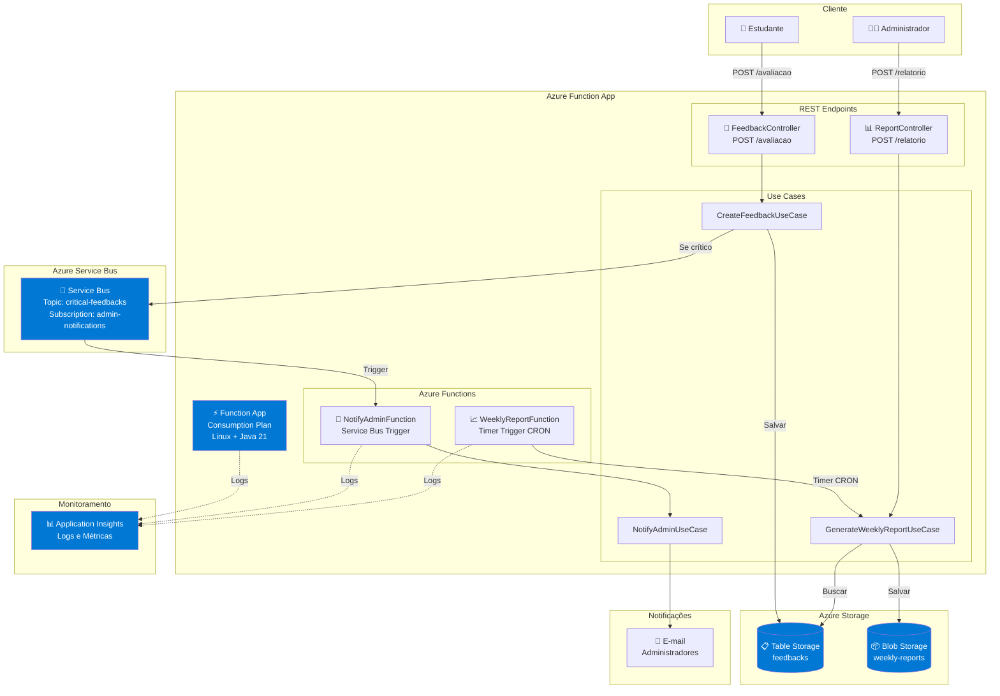
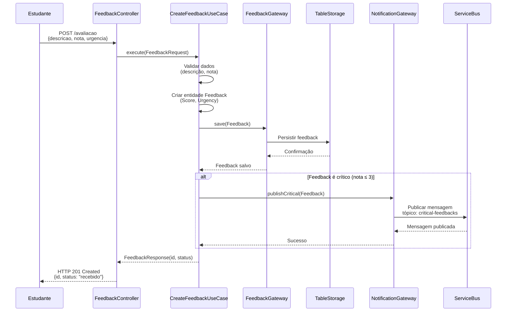
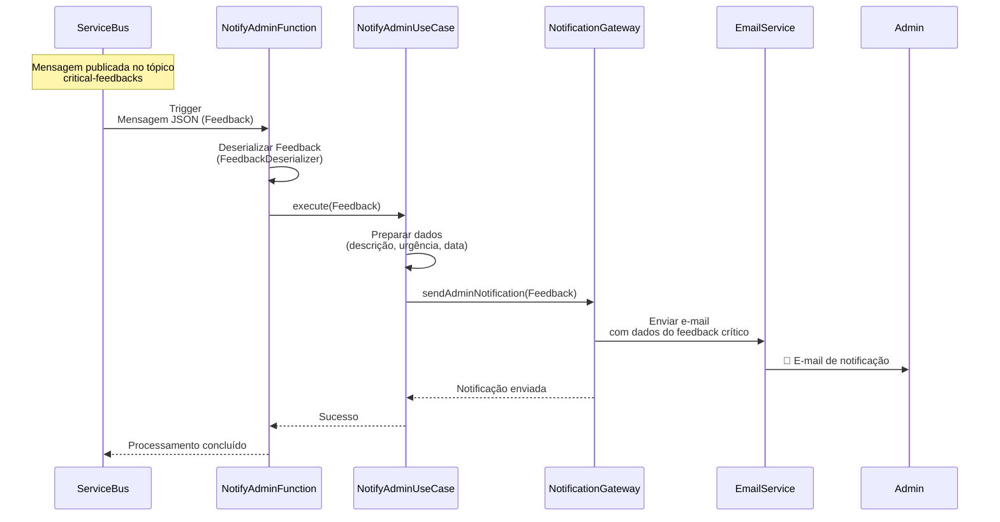
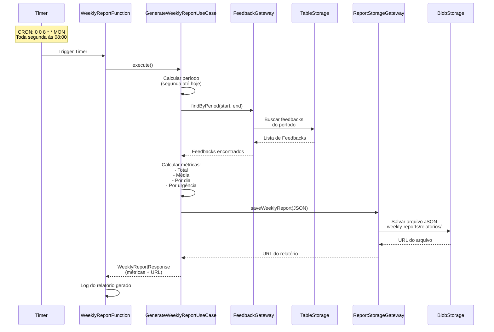
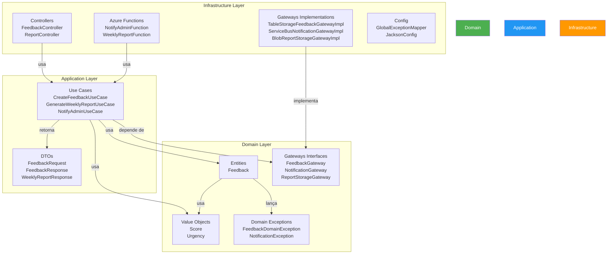
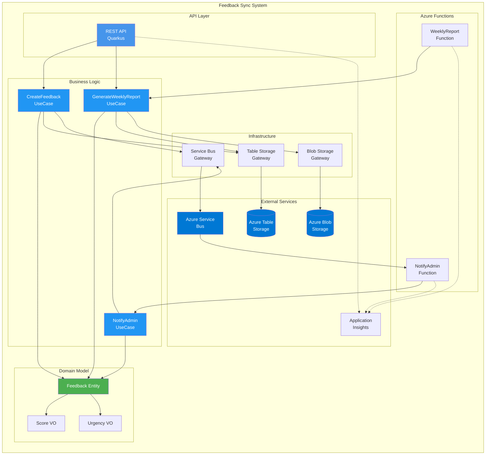
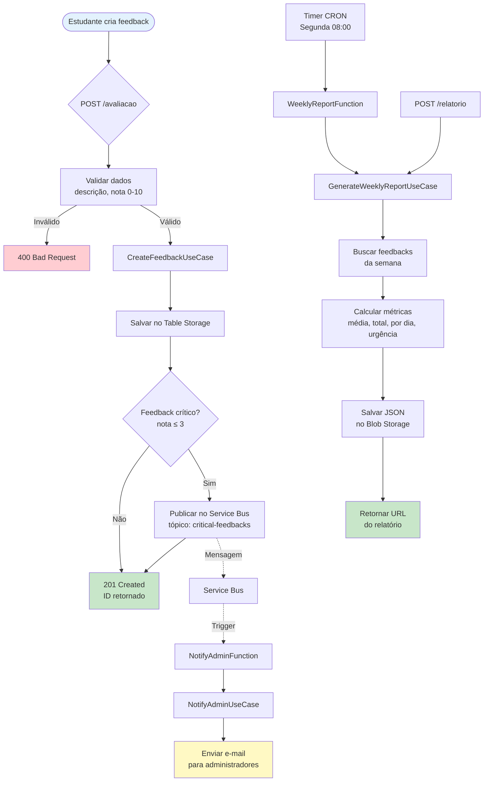
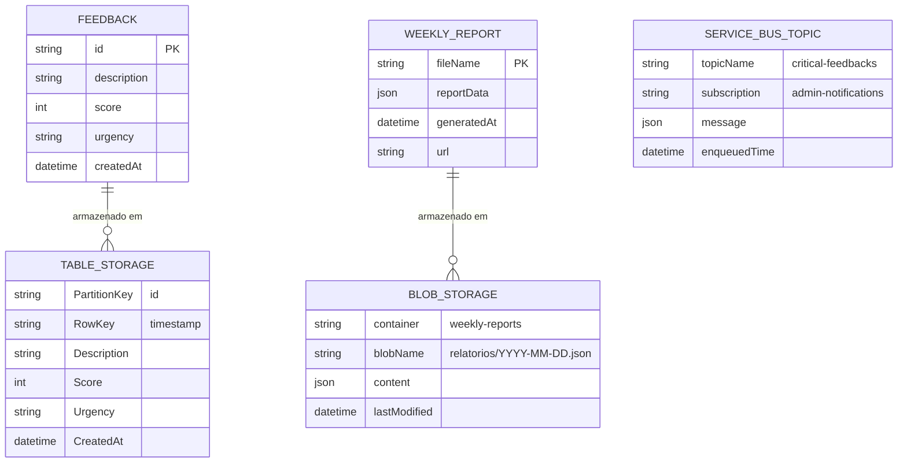
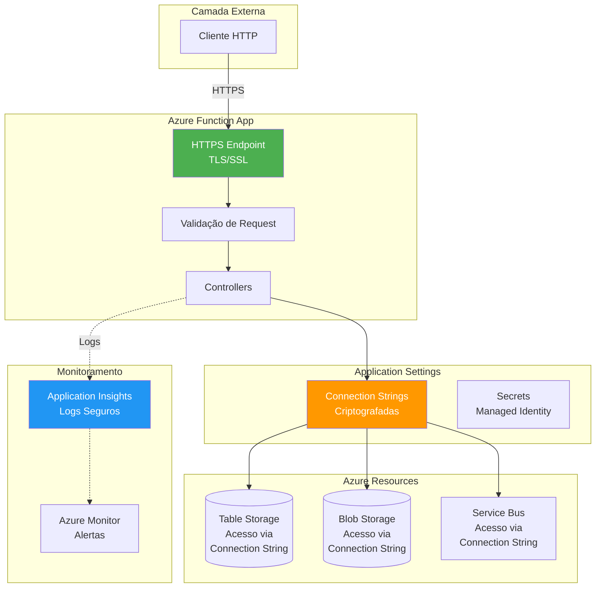

# 📊 Diagramas do Projeto Feedback Sync

Este documento contém todos os diagramas de arquitetura, fluxo e sequência do sistema.

---

## 🏗️ Diagrama de Arquitetura Azure

---

## 🔄 Diagrama de Sequência - Criação de Feedback

---

## 🔔 Diagrama de Sequência - Notificação de Feedback Crítico

---

## 📈 Diagrama de Sequência - Geração de Relatório Semanal

---

## 🏛️ Diagrama de Camadas - Clean Architecture

---

## 🔧 Diagrama de Componentes

---

## 📊 Diagrama de Fluxo de Dados Completo

---

## 🗄️ Diagrama de Dados - Estrutura de Armazenamento

---

## 🔐 Diagrama de Segurança e Acesso

---

## 📝 Legenda dos Diagramas

### Símbolos Utilizados

| Símbolo | Significado |
|---------|-------------|
| ⚡ | Azure Function |
| 📝 | Controller/Endpoint REST |
| 🔔 | Função de Notificação |
| 📈 | Função de Relatório |
| 📋 | Table Storage |
| 📦 | Blob Storage |
| 🚌 | Service Bus |
| 📊 | Application Insights |
| 📧 | E-mail |
| 👤 | Usuário/Cliente |
| 👨‍💼 | Administrador |

### Cores nos Diagramas

- **Azul (#0078D4)**: Serviços Azure
- **Verde (#4CAF50)**: Camada de Domínio / Segurança
- **Laranja (#FF9800)**: Camada de Infraestrutura
- **Azul Claro (#2196F3)**: Camada de Aplicação / Monitoramento

---

**Última atualização**: 2024
